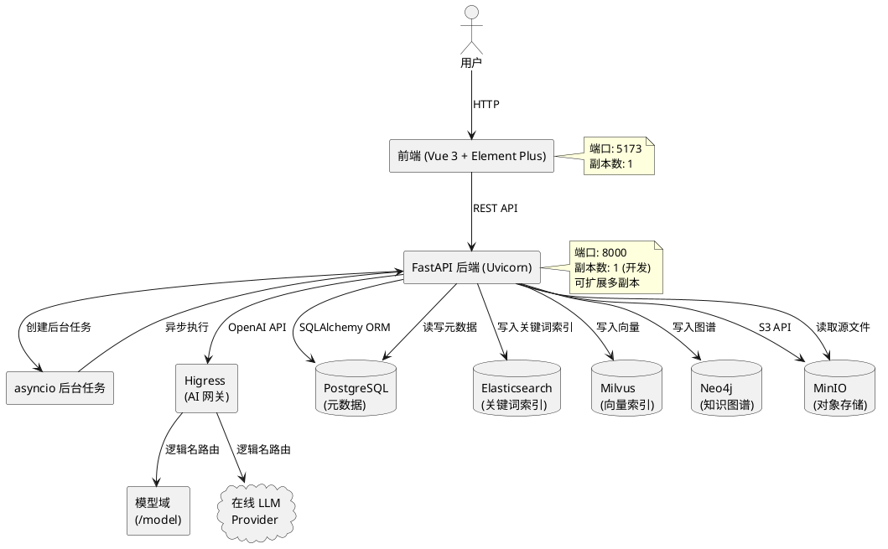

## 1. 整体架构



## 2. 技术栈

| 层级 | 技术 | 版本 | 说明 |
| :--- | :--- | :--- | :--- |
| 前端框架 | Vue 3 | 3.x | Composition API |
| UI组件库 | Element Plus | 2.x | 桌面端组件 |
| 路由 | Vue Router | 4.x | 前端路由 |
| HTTP客户端 | Fetch API | - | 原生fetch封装 |
| 后端框架 | FastAPI | 0.110+ | Python异步Web框架 |
| ASGI服务器 | Uvicorn | 0.27+ | ASGI服务器 |
| ORM | SQLAlchemy | 2.0+ | 异步ORM |
| 数据验证 | Pydantic | 2.x | 请求/响应模型 |
| 异步任务 | asyncio.create_task | - | Python原生异步任务 |
| 实时推送 | SSE | - | Server-Sent Events |

## 3. 可部署组件

| 组件 | 镜像 | 端口 | 副本数 | 说明 |
| :--- | :--- | :--- | :--- | :--- |
| 前端 | Node 22 (开发) / Nginx (生产) | 5173 / 80 | 1 | Vue 3 SPA，开发模式Vite HMR |
| 后端 | Python 3.12 (Uvicorn) | 8000 | 1 (开发) | FastAPI应用，支持开发模式热重载 |
| 模型域 | Python 3.12 (Uvicorn) | — | 1 | 与后端同进程，/model 端点，封装本地模型推理 |

## 4. 中间件

| 组件 | 镜像 | 端口 | 说明 |
| :--- | :--- | :--- | :--- |
| PostgreSQL | postgres:15-alpine | 5432 | 存储文档元数据、处理历史、版本信息、用户信息、系统配置 |
| Elasticsearch | elasticsearch:8.12.0 | 9200, 9300 | 文档内容关键词索引，支持全文检索 |
| Milvus | milvusdb/milvus:v2.4.0 | 19530, 9091 | 向量数据库，存储文档chunk的向量嵌入，支持语义搜索 |
| Neo4j | neo4j:5.15.0 | 7474, 7687 | 图数据库，存储实体关系三元组，支持图谱检索 |
| MinIO | minio/minio:latest | 9000, 9090 | S3兼容对象存储，存储原始文档文件和提取的图片 |
| Higress | higress-registry.cn-hangzhou.cr.aliyuncs.com/higress/higress:latest | 8080, 8443 | AI 网关，统一 LLM 路由，模型与提供商解耦 |
| etcd | quay.io/coreos/etcd:v3.5.5 | 2379 | Milvus元数据存储依赖 |

## 5. 数据库与存储职责

| 存储 | 职责 |
| :--- | :--- |
| PostgreSQL | 文档元数据（标题、文件名、哈希、状态）、处理历史记录、知识库版本信息、文档-版本关联关系、用户信息、搜索历史、文档清理日志、系统配置 |
| Elasticsearch | 构建域写入文档分块文本索引；检索域读取执行全文关键词搜索 |
| Milvus | 构建域写入文档分块向量嵌入；检索域读取执行语义相似性检索 |
| Neo4j | 构建域写入实体-关系-实体三元组；检索域读取执行知识图谱查询 |
| MinIO | 原始文档文件（按MD5哈希命名）、文档提取的图片 |

### 5.1 数据流向

- **构建域（写入）**：文档处理流水线完成后，将数据写入 ES / Milvus / Neo4j，以 chunk_id 为关联键汇聚到 PostgreSQL `document_chunk.processed_text`
- **检索域（读取）**：通过 `/retrieval`（API）和 `/retrieval/debug`（调试页）两种入口查询知识库，多路召回后经合并策略（RRF / 归一化加权）和重排序返回结果

## 6. Docker 集成

### 6.1 配置文件

| 文件 | 说明 |
| :--- | :--- |
| `docker-compose.yml` | 主配置文件，通过`include`指令集成中间件和应用配置 |
| `docker-compose-midware.yml` | 定义所有中间件服务（PostgreSQL, Elasticsearch, Milvus, Neo4j, MinIO, Higress, etcd） |
| `docker-compose-app.yml` | 定义应用服务（backend, frontend） |

### 6.2 启动方式

```bash
# 启动所有服务
docker-compose up -d

# 仅启动中间件（本地开发调试后端）
docker-compose -f docker-compose-midware.yml up -d

# 仅启动应用（中间件已运行时）
docker-compose -f docker-compose-app.yml up -d
```

### 6.3 数据持久化

- 中间件数据通过 bind mount 持久化到 `VOLUME_BASE` 目录（默认 `../knowlebase-volume`）
- Neo4j 使用 Docker named volume（`neo4j_data`），避免 Windows 下 bind mount 的 chown 性能问题
- 应用代码通过 bind mount 挂载，支持开发模式热重载

## 7. 关键技术选型说明

| 选型 | 备选方案 | 选择理由 |
| :--- | :--- | :--- |
| 多数据库分离 | 单一数据库（如 PostgreSQL + pgvector） | 各司其职：ES负责关键词、Milvus负责向量、Neo4j负责图谱、PostgreSQL负责结构化元数据 |
| 异步处理（asyncio.create_task） | Celery / RQ | 当前规模使用Python原生异步任务即可，无需独立队列中间件 |
| PDF解析（pdfplumber） | PyPDF2 | pdfplumber支持文本位置、表格、图片提取，精度更高 |
| 实时推送（SSE） | WebSocket | SSE更简单，单向推送场景足够，浏览器原生支持重连 |

## 8. AI 网关与模型路由

系统通过 Higress AI 网关统一路由所有模型请求（嵌入、解析、分块、图片描述、实体抽取、重排序）。应用代码以逻辑名标识调用目标，Higress 根据逻辑名路由到本地模型域或在线提供商。

| 配置项 | 类型 | 默认值 | 说明 |
| :--- | :--- | :--- | :--- |
| `LLM_API_BASE` | str | `http://higress:8080/v1` | Higress 网关地址（OpenAI 兼容端点） |

应用使用的逻辑名（代码常量）：

| 逻辑名 | 用途 | 路由目标 |
| :--- | :--- | :--- |
| `parsing` | 文档解析 | /model/parsing（本地 pdfplumber/docx） |
| `embedding` | 文本向量化 | /model/embedding（本地 sentence-transformers） |
| `chunking` | 文档分块 | 在线 LLM |
| `image-desc` | 图片描述 | 在线视觉模型 |
| `entity-extract` | 实体抽取 | 在线 LLM |

provider、api_key、temperature 等细节由 Higress 侧管理，应用不感知。

## 9. 开发环境要求

- **Python 版本**：后端启动、测试、脚本执行必须使用常规 Python（非 free-threaded 版本），避免 `asyncpg`、`pydantic-core` 等 C 扩展不兼容。
- **本地请求代理**：curl 请求本地服务时需加 `--noproxy 'localhost'` 避免被系统代理转发。
