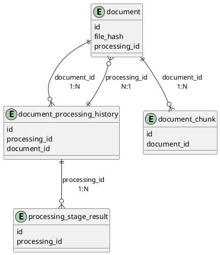
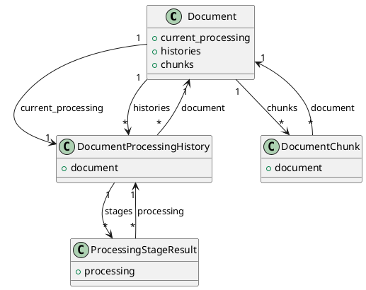

# 1. 数据结构

## 1.1 表设计

### 1.1.1 表清单

| 表名 | 表中文名 | 修改模式(A/M/D) | 备注 |
| :--- | :--- | :--- | :--- |
| document | 文档元数据表 | A | 存储文档元数据 |
| document_processing_history | 文档处理历史记录表 | A | 记录每次文档处理的详细历史 |
| processing_stage_result | 处理阶段结果表 | A | 记录各处理阶段的中间结果元信息 |
| document_chunk | 文档分块表 | A | 存储文档处理后的分块内容 |

### 1.1.2 document 表

**表设计**

| 列名 | 类型 | 非空性(Y/N) | 修改模式(A/M/D) | 备注 |
| :--- | :--- | :--- | :--- | :--- |
| id | BigInteger | N | A | 主键，自增 |
| user_id | BigInteger | Y | A | 外键，关联user表 |
| title | String(500) | N | A | 文档标题 |
| description | Text | Y | A | 文档描述 |
| original_filename | String(255) | N | A | 原始文件名 |
| file_hash | String(32) | N | A | 文件MD5哈希，32位十六进制，唯一 |
| file_size | BigInteger | Y | A | 文件大小（字节） |
| mime_type | String(100) | Y | A | 文件MIME类型 |
| file_path | String(500) | Y | A | 文件存储路径（兼容旧字段） |
| status | String(20) | N | A | 枚举：enabled/disabled |
| enabled | Boolean | N | A | 是否启用 |
| processing_id | String(36) | Y | A | 当前处理任务ID |
| attempt_no | Integer | N | A | 处理次数，>=1 |
| chunk_count | Integer | N | A | 分块数量 |
| total_token | Integer | N | A | 总token数量 |
| embedding_model | String(50) | Y | A | 向量嵌入模型 |
| category | String(100) | Y | A | 文档分类 |
| tag | ARRAY(String) | Y | A | 文档标签数组 |
| language | String(10) | N | A | 语言代码，默认zh |
| source_type | String(50) | Y | A | 来源类型：upload/api/crawl/import |
| rebuild_id | String(36) | Y | A | 关联的重建记录ID |
| created_at | TIMESTAMP | N | A | 创建时间，带时区 |
| updated_at | TIMESTAMP | N | A | 更新时间，带时区 |
| processed_at | TIMESTAMP | Y | A | 最后处理完成时间 |

**表约束**

| 约束名 | 类型 | 字段 | 说明 |
| :--- | :--- | :--- | :--- |
| pk_document | PK | id | 主键 |
| uk_document_file_hash | UNIQUE | file_hash | 文件哈希唯一 |
| fk_document_processing_id_ref_history | FK | processing_id → document_processing_history.processing_id | 当前处理任务 |

### 1.1.3 document_processing_history 表

**表设计**

| 列名 | 类型 | 非空性(Y/N) | 修改模式(A/M/D) | 备注 |
| :--- | :--- | :--- | :--- | :--- |
| id | BigInteger | N | A | 主键，自增 |
| processing_id | String(36) | N | A | 处理任务UUID |
| document_id | BigInteger | N | A | 关联 document.id |
| attempt_no | Integer | N | A | 处理次数，从1递增 |
| status | String(20) | N | A | pending/processing/succeeded/failed |
| current_stage | String(50) | Y | A | 当前阶段：check/parsed/cleaned/images_described/chunked/stored |
| progress | Integer | N | A | 进度百分比(0-100) |
| started_at | TIMESTAMP | N | A | 开始时间 |
| completed_at | TIMESTAMP | Y | A | 完成时间 |
| error_message | Text | Y | A | 失败原因 |
| created_at | TIMESTAMP | N | A | 记录时间 |

**表约束**

| 约束名 | 类型 | 字段 | 说明 |
| :--- | :--- | :--- | :--- |
| pk_document_processing_history | PK | id | 主键 |
| fk_history_document_id_ref_document | FK | document_id → document.id | 关联文档 |
| check_processing_status | CHECK | status | 限制 status 为 pending/processing/succeeded/failed |
| check_progress_range | CHECK | progress | 限制 progress 在 0-100 之间 |
| uk_history_document_attempt_no | UNIQUE | document_id, attempt_no | 同一文档处理次数唯一 |
| uk_history_processing_id | UNIQUE | processing_id | 处理任务ID全局唯一 |
| idx_processing_history_document_id | INDEX | document_id | 按文档查询处理历史 |
| idx_processing_history_processing_id | INDEX | processing_id | 按处理任务ID查询 |

### 1.1.4 processing_stage_result 表

**表设计**

| 列名 | 类型 | 非空性(Y/N) | 修改模式(A/M/D) | 备注 |
| :--- | :--- | :--- | :--- | :--- |
| id | BigInteger | N | A | 主键，自增 |
| processing_id | String(36) | N | A | 关联 document_processing_history.processing_id |
| stage_name | String(50) | N | A | 阶段名：check/parsed/cleaned/images_described/chunked/stored |
| status | String(20) | N | A | running/succeeded/failed |
| duration_ms | Integer | N | A | 阶段耗时（毫秒） |
| result_path | String(500) | Y | A | MinIO 路径（processing-results/{processing_id}/{stage}.json） |
| error_message | Text | Y | A | 失败原因 |
| created_at | TIMESTAMP | N | A | 记录时间 |

**表约束**

| 约束名 | 类型 | 字段 | 说明 |
| :--- | :--- | :--- | :--- |
| pk_processing_stage_result | PK | id | 主键 |
| fk_stage_processing_id_ref_history | FK | processing_id → document_processing_history.processing_id | 关联处理记录 |
| idx_stage_processing_id | INDEX | processing_id | 按处理任务ID查询阶段结果 |

### 1.1.5 document_chunk 表

**表设计**

| 列名 | 类型 | 非空性(Y/N) | 修改模式(A/M/D) | 备注 |
| :--- | :--- | :--- | :--- | :--- |
| id | BigInteger | N | A | 主键，自增 |
| document_id | BigInteger | N | A | 关联 document.id |
| chunk_index | Integer | N | A | 分块序号，从 0 递增 |
| original_text | Text | N | A | 原始文本，调测用 |
| processed_text | Text | N | A | 处理后文本 |
| processed_text_token_count | Integer | N | A | processed_text 的 token 数 |
| hypothetical_questions | JSONB | N | A | 假设性问题列表 |
| hypothetical_questions_token_count | Integer | N | A | 拼接后文本的 token 数 |
| relations | JSONB | N | A | 关系三元组列表 |
| page_range_start | Integer | N | A | 起始页码 |
| page_range_end | Integer | N | A | 结束页码 |
| section_title | String(500) | N | A | 所属章节标题 |

**表约束**

| 约束名 | 类型 | 字段 | 说明 |
| :--- | :--- | :--- | :--- |
| pk_document_chunk | PK | id | 主键 |
| fk_chunk_document_id_ref_document | FK | document_id → document.id | 关联文档 |
| uk_document_chunk_index | UNIQUE | document_id, chunk_index | 同一文档分块序号唯一 |

### 1.1.6 ER图



# 2. 领域类设计

## 2.1 类清单

| 模块.类名 | 对应表 | 说明 |
| :--- | :--- | :--- |
| admin.document.domain.Document | document | 文档领域对象 |
| admin.document.domain.DocumentProcessingHistory | document_processing_history | 处理历史领域对象 |
| admin.document.domain.ProcessingStageResult | processing_stage_result | 阶段结果领域对象 |
| admin.document.domain.DocumentChunk | document_chunk | 文档分块领域对象 |
| admin.document.domain.ChunkResult | - | 分块结果数据类 |
| admin.document.domain.ParseResult | - | 解析结果数据类 |

## 2.2 领域类详情

### 2.2.1 Document

**字段映射**

| 字段名 | 存储映射 | 备注 |
| :--- | :--- | :--- |
| id | id | 领域对象标识 |
| file_hash | file_hash | 文件MD5 |
| original_filename | original_filename | 原始文件名 |
| enabled | enabled | 启用状态 |
| current_processing | processing_id | 关联 DocumentProcessingHistory，通过外键关联，指向当前处理记录 |
| histories | - | 关联 DocumentProcessingHistory 集合，反向查询所有处理历史 |

**内部方法说明**

| 方法 | 入口 | 流程 |
| :--- | :--- | :--- |
| enable() | Document.enable() | 设置 enabled=true，更新 updated_at |
| disable() | Document.disable() | 设置 enabled=false，更新 updated_at |

#### DocumentStatus

| 枚举名 | 持久化值 | 说明 |
| :--- | :--- | :--- |
| `ENABLED` | "enabled" | 启用状态 |
| `DISABLED` | "disabled" | 停用状态 |

### 2.2.2 DocumentProcessingHistory

**字段映射**

| 字段名 | 存储映射 | 备注 |
| :--- | :--- | :--- |
| id | id | 领域对象标识 |
| processing_id | processing_id | 处理任务UUID |
| document | document_id | 关联 Document，通过外键关联 |
| status | status | 处理状态 |

#### ProcessingStatus

| 枚举名 | 持久化值 | 说明 |
| :--- | :--- | :--- |
| `PENDING` | "pending" | 待处理 |
| `PROCESSING` | "processing" | 处理中 |
| `SUCCEEDED` | "succeeded" | 处理成功 |
| `FAILED` | "failed" | 处理失败 |

### 2.2.3 ProcessingStageResult

**字段映射**

| 字段名 | 存储映射 | 备注 |
| :--- | :--- | :--- |
| id | id | 领域对象标识 |
| processing | processing_id | 关联 DocumentProcessingHistory，通过外键关联 |
| stage_name | stage_name | 阶段名 |
| result_path | result_path | MinIO 结果路径 |

### 2.2.4 ChunkResult

| 字段名 | 类型 | 备注 |
| :--- | :--- | :--- |
| original_text | str | 原始文本 |
| processed_text | str | 处理后文本 |
| hypothetical_questions | List[str] | 假设性问题列表（HyDE） |
| relations | List[Tuple[str,str,str]] | 关系三元组 |
| page_range | Tuple[int,int] | 页码范围 |
| section_title | str | 所属章节标题 |

### 2.2.5 ParseResult

| 字段名 | 类型 | 备注 |
| :--- | :--- | :--- |
| sections | List[ParsedSection] | 章节段落列表 |
| text_elements | List[ParsedText] | 纯文本元素 |
| image_elements | List[ParsedImage] | 图片元数据 |
| table_elements | List[ParsedTable] | 表格数据 |

### 2.2.6 DocumentChunk

**字段映射**

| 字段名 | 存储映射 | 备注 |
| :--- | :--- | :--- |
| id | id | 领域对象标识 |
| document | document_id | 关联 Document，通过外键关联 |
| chunk_index | chunk_index | 分块序号 |
| original_text | original_text | 原始文本，调测用 |
| processed_text | processed_text | 处理后文本 |
| processed_text_token_count | processed_text_token_count | processed_text 的 token 数 |
| hypothetical_questions | hypothetical_questions | 假设性问题列表 |
| hypothetical_questions_token_count | hypothetical_questions_token_count | 拼接后文本的 token 数 |
| relations | relations | 关系三元组列表 |
| page_range | page_range_start, page_range_end | 页码范围 |
| section_title | section_title | 所属章节标题 |

## 2.3 类图



# 3. 事件设计

## 3.1 事件清单

| 事件名 | 主题 | 处理模式 | 说明 |
| :--- | :--- | :--- | :--- |
| `Document_Processing_Event` | `admin.document.processing_event` | 广播 | 文档处理流水线阶段事件 |

## 3.2 Document_Processing_Event

### 3.2.1 事件接口

生产者 API，处理流水线各阶段完成后调用对应方法。各方法内部创建 StageCompletedEvent 消息体，委托 ProcessingEventBus 分发。

**内部方法说明**

| 方法 | 入口 | 流程 |
| :--- | :--- | :--- |
| checked(processing_id) | Document_Processing_Event.checked() | 创建 StageCompletedEvent(stage_name="check")，调用 ProcessingEventBus.publish() |
| parsed(processing_id) | Document_Processing_Event.parsed() | 创建 StageCompletedEvent(stage_name="parsed")，调用 ProcessingEventBus.publish() |
| cleaned(processing_id) | Document_Processing_Event.cleaned() | 创建 StageCompletedEvent(stage_name="cleaned")，调用 ProcessingEventBus.publish() |
| images_described(processing_id) | Document_Processing_Event.images_described() | 创建 StageCompletedEvent(stage_name="images_described")，调用 ProcessingEventBus.publish() |
| chunked(processing_id) | Document_Processing_Event.chunked() | 创建 StageCompletedEvent(stage_name="chunked")，调用 ProcessingEventBus.publish() |
| stored(processing_id) | Document_Processing_Event.stored() | 创建 StageCompletedEvent(stage_name="stored")，调用 ProcessingEventBus.publish() |
| processing_failed(processing_id, error_message) | Document_Processing_Event.processing_failed() | 创建 StageCompletedEvent(status="failed")，调用 ProcessingEventBus.publish() |

**ProcessingEventBus**

事件分发实现，供事件接口各方法内部调用。

| 方法 | 入口 | 流程 |
| :--- | :--- | :--- |
| publish(event) | ProcessingEventBus.publish() | 将 StageCompletedEvent 放入 asyncio.Queue |
| subscribe() | ProcessingEventBus.subscribe() | 注册监听器，返回生成器消费事件 |

### 3.2.2 事件消息体

**StageCompletedEvent**

| 字段名 | 类型 | 备注 |
| :--- | :--- | :--- |
| processing_id | str | 处理任务ID |
| stage_name | str | 阶段名 |
| status | str | 阶段状态（running/succeeded/failed） |
| duration_ms | int | 阶段耗时（毫秒） |

### 3.2.3 事件消费者

#### 3.2.3.1 监视器事件

**ProcessingMonitor**，实例数：N（每个监控页面一个实例）。

通过 ProcessingEventBus.subscribe() 订阅事件，将阶段事件通过 SSE 推送给对应前端页面。

**内部方法说明**

| 方法 | 入口 | 流程 |
| :--- | :--- | :--- |
| on_event(event) | ProcessingMonitor.on_event() | 接收 StageCompletedEvent，过滤当前监控的 processing_id，序列化为 JSON 通过 SSE 推送给前端 |
| close() | ProcessingMonitor.close() | 页面关闭 SSE 连接时调用，取消订阅并释放实例 |

# 4. 后端功能设计

## 4.1 模块前缀

| 模块 | 入口路径 |
| :--- | :--- |
| 文档管理 | admin.document.api |

## 4.2 异常枚举

**枚举类名**: `DocumentErrorCode`（Python 枚举成员名遵循 PEP 8，使用全大写）

| 枚举名 | 状态码 | 描述 |
| :--- | :--- | :--- |
| `DOCUMENT_NOT_FOUND` | 404001 | 文档不存在 |
| `FILE_FORMAT_NOT_SUPPORTED` | 400001 | 仅支持PDF/Word格式 |
| `FILE_SIZE_EXCEEDED` | 400002 | 文件大小超过100MB限制 |
| `FILE_DUPLICATE` | 409001 | 文件哈希与已有记录重复 |
| `STORAGE_UNAVAILABLE` | 503001 | MinIO存储服务不可用 |
| `DATABASE_UNAVAILABLE` | 503002 | 数据库服务不可用 |
| `DOCUMENT_SAVE_FAILED` | 500002 | 文档持久化失败 |
| `DOCUMENT_ALREADY_ENABLED` | 001001 | 文档已启用，无需重复操作（警告码） |
| `DOCUMENT_ALREADY_DISABLED` | 001002 | 文档已停用，无需重复操作（警告码） |
| `DOCUMENT_PROCESSING_IN_PROGRESS` | 001003 | 文档正在处理中，请稍后再试（警告码） |
| `INVALID_PARAMETER` | 400004 | 参数校验失败 |
| `PARSING_FAILED` | 500003 | 文档解析失败 |
| `LLM_UNAVAILABLE` | 503003 | LLM服务不可用 |
| `CHUNKING_FAILED` | 500004 | 文档分块失败 |

## 4.3 API清单

| 方法 | URL | 代码入口 | 名称 | 对应REQ章节 |
| :--- | :--- | :--- | :--- | :--- |
| POST | /build/document/check | check_documents | 文件重复性校验 | REQ #4 |
| POST | /build/document/upload | upload_document | 单文件上传 | REQ #4 |
| GET | /build/document/list | query_document_list | 文档列表分页查询 | REQ #3 |
| GET | /build/document/detail | query_document_detail | 文档详情查询 | REQ #5 |
| PUT | /build/document/enable | enable_documents | 文档启用 | REQ #6 |
| PUT | /build/document/disable | disable_documents | 文档停用 | REQ #7 |
| POST | /build/document/process | process_documents | 文档处理 | REQ #8 |
| GET | /build/processing/status/{processing_id} | get_processing_status | 处理状态查询 | REQ #9 |
| GET | /build/processing/stage/{processing_id}/{stage_name} | get_stage_result | 阶段结果详情 | REQ #9 |
| GET | /build/processing/view | get_processing_view | 处理过程视图 | REQ #10 |

## 4.4 文件重复性校验

### 4.4.1 请求模型

| 字段 | 类型 | 必填 | 说明 |
| :--- | :--- | :--- | :--- |
| hashes | List[str] | M | 文件MD5哈希列表，32位十六进制 |

### 4.4.2 响应模型

```json
{
  "code": "000000",
  "description": "成功",
  "content": {
    "duplicates": [
      { "hash": "abc123...", "document_id": 1, "filename": "report.pdf" }
    ]
  }
}
```

### 4.4.3 处理流程

1) 校验请求体中每个文件的 hash 格式为32位十六进制
2) 查询 document 表中 file_hash 存在于请求列表中的记录
3) 返回重复文件列表（包含已存在文档ID和文件名）
4) 抛出异常：数据库不可访问时抛出 `DATABASE_UNAVAILABLE`，记录 ERROR 日志

## 4.5 单文件上传

### 4.5.1 请求模型

文件上传表单，multipart/form-data。

| 字段 | 类型 | 必填 | 说明 |
| :--- | :--- | :--- | :--- |
| file | File | M | PDF/Word文件，<=100MB |

### 4.5.2 响应模型

```json
{
  "code": "000000",
  "description": "成功",
  "content": {
    "document_id": 1,
    "filename": "report.pdf"
  }
}
```

### 4.5.3 处理流程

1) 读取上传文件内容，计算MD5哈希
2) 校验文件格式，非PDF/Word则抛出 `FILE_FORMAT_NOT_SUPPORTED`
3) 校验文件大小，超过100MB则抛出 `FILE_SIZE_EXCEEDED`
4) 查询 document 表中 file_hash 是否已存在，存在则抛出 `FILE_DUPLICATE`
5) 将文件保存到 MinIO（以 MD5 哈希为文件名），保存失败则抛出 `STORAGE_UNAVAILABLE`，记录 ERROR 日志
6) 开启数据库事务：
   - INSERT document 记录（enabled=true, attempt_no=1）
   - INSERT document_processing_history 记录（status='pending', attempt_no=1）
7) 提交事务，提交失败则回滚并尝试从 MinIO 删除已写入的孤立文件，抛出 `DOCUMENT_SAVE_FAILED`
8) 后台异步触发文档处理任务，触发失败记录 DEBUG 日志不影响主流程

## 4.6 文档列表分页查询

### 4.6.1 请求模型

| 字段 | 类型 | 必填 | 说明 |
| :--- | :--- | :--- | :--- |
| page | Integer | M | 页码，默认1 |
| page_size | Integer | M | 每页数量，默认20 |
| keyword | String | O | 关键字搜索 |
| enabled | Boolean | O | 启用状态过滤 |
| category | String | O | 分类过滤 |

### 4.6.2 响应模型

```json
{
  "code": "000000",
  "description": "成功",
  "content": {
    "total": 100,
    "page": 1,
    "page_size": 20,
    "total_pages": 5,
    "data": [...]
  }
}
```

### 4.6.3 处理流程

1) 接收分页参数（page, page_size）和过滤条件（关键字、启用状态、分类）
2) 对关键字在 original_filename、title、description 字段进行任意位置模糊匹配
3) 按启用状态、分类进行精准过滤
4) 按 created_at 降序排列，返回分页结果
5) 抛出异常：数据库不可访问时抛出 `DATABASE_UNAVAILABLE`，记录 ERROR 日志

## 4.7 文档详情查询

### 4.7.1 请求模型

| 字段 | 类型 | 必填 | 说明 |
| :--- | :--- | :--- | :--- |
| document_id | BigInteger | M | 文档ID |

### 4.7.2 响应模型

```json
{
  "code": "000000",
  "description": "成功",
  "content": {
    "document": { ... },
    "processing_history": [ ... ]
  }
}
```

### 4.7.3 处理流程

1) 查询 document 表获取文档元数据，不存在则抛出 `DOCUMENT_NOT_FOUND`
2) 查询 document_processing_history 表获取处理历史时间线，按 attempt_no 降序
3) 返回文档详情及处理历史
4) 抛出异常：数据库不可访问时抛出 `DATABASE_UNAVAILABLE`，记录 ERROR 日志

## 4.8 启用文档

### 4.8.1 请求模型

| 字段 | 类型 | 必填 | 说明 |
| :--- | :--- | :--- | :--- |
| document_ids | List[BigInteger] | M | 文档ID列表 |

### 4.8.2 响应模型

```json
{
  "code": "000000",
  "description": "成功",
  "content": {
    "results": [
      { "id": 1, "status": "success" },
      { "id": 2, "status": "failed", "reason": "文档已启用，无需重复操作" }
    ]
  }
}
```

### 4.8.3 处理流程

1) 校验 document_ids 不为空
2) 遍历每个 document_id：
   - 查询文档是否存在，不存在则记录 `DOCUMENT_NOT_FOUND`
   - 校验文档未处于 enabled 状态，已启用则记录警告码 `DOCUMENT_ALREADY_ENABLED`
   - UPDATE document 设置 enabled=true，更新 updated_at
3) 提交事务，提交失败则抛出 `DATABASE_UNAVAILABLE`
4) 返回每条记录的启用结果

## 4.9 停用文档

### 4.9.1 请求模型

| 字段 | 类型 | 必填 | 说明 |
| :--- | :--- | :--- | :--- |
| document_ids | List[BigInteger] | M | 文档ID列表 |

### 4.9.2 响应模型

```json
{
  "code": "000000",
  "description": "成功",
  "content": {
    "results": [
      { "id": 1, "status": "success" },
      { "id": 2, "status": "failed", "reason": "文档已停用，无需重复操作" }
    ]
  }
}
```

### 4.9.3 处理流程

1) 校验 document_ids 不为空
2) 遍历每个 document_id：
   - 查询文档是否存在，不存在则记录 `DOCUMENT_NOT_FOUND`
   - 校验文档未处于 disabled 状态，已停用则记录警告码 `DOCUMENT_ALREADY_DISABLED`
   - UPDATE document 设置 enabled=false，更新 updated_at
3) 提交事务，提交失败则抛出 `DATABASE_UNAVAILABLE`
4) 返回每条记录的停用结果

## 4.10 文档处理

### 4.10.1 请求模型

| 字段 | 类型 | 必填 | 说明 |
| :--- | :--- | :--- | :--- |
| document_ids | List[BigInteger] | M | 文档ID列表 |

### 4.10.2 响应模型

```json
{
  "code": "000000",
  "description": "成功",
  "content": {
    "results": [
      { "id": 1, "status": "success", "processing_id": "xxx-xxx" },
      { "id": 2, "status": "failed", "reason": "文档正在处理中" }
    ]
  }
}
```

### 4.10.3 处理流程

1) 校验 document_ids 不为空
2) 遍历每个 document_id：
   - 查询 document 表获取文档记录，不存在则记录 `DOCUMENT_NOT_FOUND`
   - 查询 document_processing_history 表中该文档是否存在 status='processing' 的记录，存在则记录警告码 `DOCUMENT_PROCESSING_IN_PROGRESS`
   - 查询当前最大的 attempt_no，计算新值为 max+1
   - UPDATE document 设置 processing_id 和 attempt_no
3) 后台异步触发文档处理任务（传递 document_id、processing_id、attempt_no），触发失败记录 ERROR 日志
4) 返回每条记录的处理任务ID和进度流URL

### 4.10.4 运行配置

#### 模型配置

| 配置项 | 类型 | 默认值 | 说明 |
| :--- | :--- | :--- | :--- |
| `chunking_enabled` | boolean | `false` | 分块模型开关，`true` 时使用以下五元组，`false` 时回退默认模型 |
| `chunking_model` | str | — | 模型名称 |
| `chunking_model_provider` | str | — | 模型供应商 |
| `chunking_api_key` | str | — | API 密钥 |
| `chunking_api_base` | str | — | API 地址（可选，自定义/私有部署时填写） |
| `chunking_temperature` | float | — | 温度参数 |
| `image_describer_enabled` | boolean | `false` | 图片描述模型开关，`true` 时使用以下五元组，`false` 时回退默认模型 |
| `image_describer_model` | str | — | 视觉模型名称 |
| `image_describer_model_provider` | str | — | 模型供应商 |
| `image_describer_api_key` | str | — | API 密钥 |
| `image_describer_api_base` | str | — | API 地址（可选，自定义/私有部署时填写） |
| `image_describer_temperature` | float | — | 温度参数 |

#### 分块参数

| 功能 | 说明 |
| :--- | :--- |
| 最大分块字符数 | `chunk_max_chars`，默认 `800`，整数 |
| 最小分块字符数 | `chunk_min_chars`，默认 `0.5`；`(0,1)` 内为 max_chars 比例，`>1` 为绝对值 |
| 窗口重叠量 | `chunk_overlap`，默认 `0.1`；`(0,1)` 内为 max_chars 比例，`>1` 为绝对值 |
| 窗口大小 | `chunk_window`，默认 `1.5`；`(1,5)` 内为 max_chars 比例，`>5` 为绝对值 |

### 4.10.5 文档检查

**输入**：document_id, processing_id, attempt_no

**处理流程**

1) 通过 document_id 查询 document 记录，不存在则 INSERT document_processing_history（status='failed'），写入 error_message='文档不存在'，终止处理
2) 从 document 记录中读取 file_hash，检查 MinIO 文档桶中是否存在对应文件，不存在则 INSERT document_processing_history（status='failed'），写入 error_message='文档文件不存在'，终止处理
3) 尝试从 MinIO 读取文件头部验证可读性，读取失败则 INSERT document_processing_history（status='failed'），写入 error_message='文档文件不可读'，终止处理
4) INSERT document_processing_history 记录（processing_id, attempt_no, status='processing', current_stage='check', progress=10, started_at=now）
5) 抛出异常：MinIO 不可访问时抛出 `STORAGE_UNAVAILABLE`，数据库不可访问时抛出 `DATABASE_UNAVAILABLE`

**中间结果**：无（验证通过后进入下一阶段）

### 4.10.6 文档解析

**输入**：file_hash（从 MinIO 获取文件）

**处理流程**

1) 从 MinIO 下载完整文件，下载失败则 UPDATE processing_stage_result（status='failed', error_message），终止处理
2) 根据文件 MIME 类型路由到对应解析器：
   - PDF：使用 pdfplumber 提取纯文本、图片元数据、表格结构
   - Word：使用 python-docx 提取文本、图片、表格
3) 输出 ParseResult：包含 ParsedSection（章节段落）、ParsedText（纯文本）、ParsedImage（图片元数据）、ParsedTable（表格数据）
4) 解析失败则 UPDATE processing_stage_result（status='failed', error_message），记录 ERROR 日志，抛出 `PARSING_FAILED`
5) 更新处理进度 progress=30，current_stage='parsed'

**中间结果**：`ParseResult` 数据类，写入 MinIO `processing-results/{processing_id}/parsed.json`

### 4.10.7 文档清洗

**输入**：ParseResult（上一阶段输出）

**处理流程**

1) 执行 Phase1 基础清洗：
   - 去除多余空行、空格
   - 修复跨页段落断裂
   - 统一标题格式
2) 执行 Phase2 PDF 特有清洗：
   - 去除页眉、页脚、页码
   - 去除水印文本
3) 处理封面、封底、目录：
   - 识别并移除封面封底重复内容
   - 将目录页转换为章节索引结构
4) 输出清洗后的 ParseResult，元素类型包含：text、image、table、heading
5) 更新处理进度 progress=50，current_stage='cleaned'

**中间结果**：清洗后的 `ParseResult`，写入 MinIO `processing-results/{processing_id}/cleaned.json`

### 4.10.8 图片描述生成

**输入**：ParseResult（包含 ParsedImage 元素）

**处理流程**

1) 遍历 ParseResult 中的 ParsedImage 元素
2) 从 MinIO 读取图片文件，使用视觉模型生成描述文字
3) 用 `[IMAGE_START:caption] 描述文字 [IMAGE_END]` 替换原图片位置，保留原始 ParsedImage 信息
4) 更新处理进度 progress=60，current_stage='images_described'

**中间结果**：包含图片描述的 ParseResult（无独立写入，合并到下一阶段）

### 4.10.9 文档分块

**输入**：ParseResult（清洗后含图片描述）

**处理流程**

1) 按三级标题（H1/H2/H3）将文本划分为独立分块单位，H4 及以下不作为单独分块单位，多个可合并到同一分块
2) 判断 section 文本是否 ≤ max_chars：
   - 是：直接作为一个 chunk
   - 否：进入窗口滑动
3) 执行窗口滑动：
   - 窗口大小 = max_chars
   - 滑动步长 = max_chars * overlap_ratio
4) 对每个窗口调用 LLM Pipeline（一次调用，4步流水线）：
   - 语义分割
   - 指代消解
   - 假设性问题生成（HyDE）
   - 关系三元组抽取
5) 映射 LLM 返回到 ChunkResult：`questions` → `hypothetical_questions`，`triplets` → `relations`
6) 分块后还原：
   - 还原 H4 及以下标题到所属 chunk
   - 合并过短的分块（< min_chars）
7) 输出 ChunkResult 列表，每个包含 original_text、processed_text、hypothetical_questions、relations、page_range、section_title
8) 更新处理进度 progress=80，current_stage='chunked'

**中间结果**：`List[ChunkResult]`，写入 MinIO `processing-results/{processing_id}/chunked.json`

### 4.10.10 数据入库

**输入**：List[ChunkResult]

**字段写入策略**

| 字段名 | 类型 | 写入数据库 | 备注 |
| :--- | :--- | :--- | :--- |
| original_text | str | — | 原始文本，调测用 |
| processed_text | str | Elasticsearch、Milvus | 处理后文本 |
| hypothetical_questions | List[str] | Milvus | 假设性问题列表（HyDE） |
| relations | List[Tuple[str,str,str]] | Neo4j | 关系三元组 |
| page_range | Tuple[int,int] | — | 页码范围 |
| section_title | str | — | 所属章节标题 |

以上所有字段均写入 PostgreSQL。ES、Milvus、Neo4j 仅标注其额外索引的字段。

#### Elasticsearch 索引结构

| 字段 | 类型 | 来源 | 说明 |
| :--- | :--- | :--- | :--- |
| chunk_id | VARCHAR | DB chunk.id | 关联 PostgreSQL |
| document_id | VARCHAR | 上下文 | 按文档清理 |
| keyword | text | ChunkResult.processed_text | 全文检索 |

#### Milvus 向量结构

| 字段 | 类型 | 来源 | 说明 |
| :--- | :--- | :--- | :--- |
| chunk_id | VARCHAR | DB chunk.id | 主键，关联 PostgreSQL |
| document_id | VARCHAR | 上下文 | 按文档清理 |
| vector | FloatVector | embedding(processed_text + "\n" + hypothetical_questions.join("\n")) | 语义检索 |

#### Neo4j 图谱结构

| 元素 | 属性 | 说明 |
| :--- | :--- | :--- |
| Document 节点 | `document_id` | 文档节点 |
| Entity 节点 | `name` | 实体名称，跨文档共享 |
| CONTAINS 关系 | — | Document → Entity |
| {predicate} 关系 | `document_id`, `chunk_id` | Entity → Entity |

**处理流程**

1) 清理已有数据：
   - DELETE document_chunk WHERE document_id = ?
   - DELETE ES 索引 WHERE document_id = ?
   - DELETE Milvus 向量 WHERE document_id = ?
   - Neo4j 删除：
     a) MATCH (d:Document {document_id})-[:CONTAINS]->(:Entity) DELETE CONTAINS
     b) MATCH ()-[r]->() WHERE r.document_id = ? DELETE r
     c) MATCH (d:Document {document_id}) DELETE d
     d) MATCH (e:Entity) WHERE NOT (e)<-[:CONTAINS]-() DELETE e
2) 开启 PostgreSQL 事务：
   - INSERT document_chunk（批量，遍历 ChunkResult 映射字段）
   - UPDATE document 设置 chunk_count, total_token=sum(chunk.processed_text_token_count + chunk.hypothetical_questions_token_count), processed_at
   - UPDATE document_processing_history 设置 status='succeeded', progress=100, completed_at
   - INSERT processing_stage_result（stage='stored', status='succeeded', duration_ms）
   - COMMIT，提交失败则回滚，更新处理历史状态为 'failed'，记录 ERROR 日志
3) ES 索引写入：对每个 chunk，bulk index {chunk_id, document_id, processed_text}
4) Milvus 向量写入：对每个 chunk，拼接文本 → embedding → insert {chunk_id, document_id, vector}
5) Neo4j 图谱写入：对每个三元组：
   - MERGE (d:Document {document_id})
   - MERGE (s:Entity {name: subject})
   - MERGE (o:Entity {name: object})
   - MERGE (d)-[:CONTAINS]->(s)
   - MERGE (d)-[:CONTAINS]->(o)
   - MERGE (s)-[:{predicate} {document_id, chunk_id}]->(o)
6) 步骤 3/4/5 任一步失败：UPDATE processing_history（status='failed', error_message），记录 ERROR 日志。残留数据不立即清理，下次处理同一文档时由步骤 1 统一清理。

**中间结果**：无（流水线终点）

## 4.11 处理状态查询

### 4.11.1 请求模型

路径参数：processing_id

### 4.11.2 响应模型

```json
{
  "code": "000000",
  "description": "成功",
  "content": {
    "processing_id": "xxx-xxx",
    "document_id": 1,
    "attempt_no": 2,
    "status": "processing",
    "current_stage": "chunked",
    "progress": 80,
    "started_at": "2024-01-01T00:00:00Z",
    "stages": [
      { "stage_name": "check", "status": "succeeded", "duration_ms": 500 },
      { "stage_name": "parsed", "status": "succeeded", "duration_ms": 3000 },
      { "stage_name": "chunked", "status": "running", "duration_ms": null }
    ]
  }
}
```

### 4.11.3 处理流程

1) 通过 processing_id 查询 document_processing_history 记录，不存在则抛出 `DOCUMENT_NOT_FOUND`
2) 查询 processing_stage_result 表中该 processing_id 的所有阶段记录，按 created_at 升序
3) 返回处理任务基本信息 + processing_stage_result 列表（各阶段元信息：stage_name、status、duration_ms、error_message）
4) 抛出异常：数据库不可访问时抛出 `DATABASE_UNAVAILABLE`，记录 ERROR 日志

## 4.12 阶段结果详情

### 4.12.1 请求模型

路径参数：processing_id, stage_name

### 4.12.2 响应模型

```json
{
  "code": "000000",
  "description": "成功",
  "content": {
    "stage_name": "chunked",
    "status": "succeeded",
    "duration_ms": 5000,
    "result": { ... }
  }
}
```

### 4.12.3 处理流程

1) 通过 processing_id 和 stage_name 查询 processing_stage_result 记录，不存在则抛出 `DOCUMENT_NOT_FOUND`
2) 校验阶段 status 为 'succeeded'，非 succeeded 则抛出 `PARSING_FAILED`（表示该阶段未完成或失败）
3) 从 result_path 读取 MinIO 中的 JSON 文件，读取失败则抛出 `STORAGE_UNAVAILABLE`
4) 返回 JSON 格式的中间结果内容
5) 抛出异常：MinIO 不可访问时抛出 `STORAGE_UNAVAILABLE`，数据库不可访问时抛出 `DATABASE_UNAVAILABLE`，均记录 ERROR 日志

## 4.13 处理过程视图

### 4.13.1 请求模型

查询参数：

| 字段 | 类型 | 必填 | 说明 |
| :--- | :--- | :--- | :--- |
| document_ids | String | M | 逗号分隔的文档ID列表 |

### 4.13.2 响应模型

```json
{
  "code": "000000",
  "description": "成功",
  "content": {
    "tabs": [
      {
        "document_id": 1,
        "document_name": "report.pdf",
        "processing_id": "xxx-xxx",
        "attempt_no": 2,
        "status": "processing",
        "progress": 80,
        "stages": [
          { "name": "check", "status": "succeeded" },
          { "name": "parsed", "status": "succeeded" },
          { "name": "cleaned", "status": "succeeded" },
          { "name": "images_described", "status": "succeeded" },
          { "name": "chunked", "status": "running" },
          { "name": "store", "status": "pending" }
        ],
        "error_message": null
      }
    ]
  }
}
```

### 4.13.3 处理流程

1) 接收 document_ids 列表
2) 遍历每个 document_id，查询最新的 processing_history 和 processing_stage_result
3) 返回多tab视图数据，每个tab对应一个文档的处理过程
4) 抛出异常：数据库不可访问时抛出 `DATABASE_UNAVAILABLE`，记录 ERROR 日志

