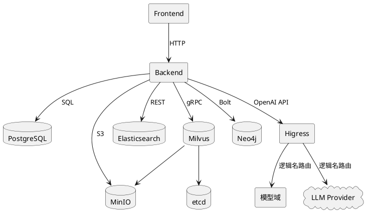

---
README
---

# 项目概述
知识库构建与检索系统——企业文档智能解析、向量化存储、多模态检索，一站式知识管理平台。

# 系统架构

## 组件拓扑

| 组件 | 角色 | 说明 |
| :--- | :--- | :--- |
| Frontend (Vue 3) | 应用 | Web 管理控制台 |
| Backend (FastAPI) | 应用 | REST API + 异步文档处理 |
| 模型域 (/model) | 应用 | 本地模型推理（嵌入、解析），与 Backend 同进程 |
| PostgreSQL 15 | 数据库 | 文档元数据、处理历史、版本信息 |
| Elasticsearch 8.12 | 搜索引擎 | 文档内容关键词索引 |
| Milvus 2.4 | 向量数据库 | 语义相似性检索 |
| Neo4j 5.14 | 图数据库 | 实体关系知识图谱 |
| MinIO | 对象存储 | 原始文档、中间结果文件 |
| Higress | AI 网关 | 统一 LLM 路由，模型与提供商解耦 |
| etcd 3.5 | 元数据存储 | Milvus 依赖 |

## 组件依赖关系


# 运行环境

| 环境 | 版本/要求 |
| :--- | :--- |
| 操作系统 | Windows 10+ / Linux / macOS |
| Docker | 20.10+ (Compose v2.20+) |
| Python | 3.12 |
| 内存 | ≥ 8 GB |
| 磁盘 | ≥ 50 GB (含数据卷) |

# 中间件依赖

| 组件 | 版本 | 默认端口 | 用途 |
| :--- | :--- | :--- | :--- |
| PostgreSQL | 15-alpine | 5432 | 结构化元数据 |
| Elasticsearch | 8.12.0 | 9200 | 关键词全文检索 |
| Milvus | v2.4.0 | 19530 | 向量语义检索 |
| Neo4j | 5.14.0 | 7687 | 知识图谱 |
| MinIO | latest | 9000 | 对象存储 |
| Higress | latest | 8080 | AI 网关，模型路由 |
| etcd | v3.5.5 | 2379 | Milvus 元数据 |

# 部署指南

## 1. 获取代码

```bash
git clone <repository-url>
cd knowlebase
```

## 2. 配置文件

复制 `.env` 为 `.env` 并按需修改：

```bash
cp .env.example .env    # 如 .env 不存在则从模板复制
```

最小必改项：

| 配置项 | 说明 |
| :--- | :--- |
| `VOLUME_BASE` | 数据持久化根目录，默认 `E:/project/knowlebase-volume` |
| `LLM_API_BASE` | Higress 网关地址，默认 `http://higress:8080/v1` |
| `SECRET_KEY` | 应用密钥 |

## 3. 一键启动

```bash
docker-compose up -d
```

如需仅启动中间件（本地调试后端）：

```bash
docker-compose -f docker-compose-midware.yml up -d
```

## 4. 验证

```bash
# 后端健康检查
curl --noproxy localhost http://localhost:8000/docs

# 各中间件控制台
# MinIO Console:  http://localhost:9090 (minioadmin / minioadmin)
# Neo4j Browser:  http://localhost:7474
```

# 配置参考

## 数据库连接

| 配置项 | 类型 | 默认值 | 说明 |
| :--- | :--- | :--- | :--- |
| `POSTGRES_HOST` | str | `localhost` | PostgreSQL 地址 |
| `POSTGRES_PORT` | int | `5432` | PostgreSQL 端口 |
| `POSTGRES_USER` | str | `knowlebase` | 数据库用户 |
| `POSTGRES_PASSWORD` | str | `knowlebase_password` | 数据库密码 |
| `POSTGRES_DB` | str | `knowlebase` | 数据库名 |

## 中间件地址

| 配置项 | 类型 | 默认值 | 说明 |
| :--- | :--- | :--- | :--- |
| `ELASTICSEARCH_HOST` | str | `localhost` | ES 地址 |
| `ELASTICSEARCH_PORT` | int | `9200` | ES 端口 |
| `MILVUS_HOST` | str | `localhost` | Milvus 地址 |
| `MILVUS_PORT` | int | `19530` | Milvus 端口 |
| `NEO4J_HOST` | str | `localhost` | Neo4j 地址 |
| `NEO4J_PORT` | int | `7687` | Neo4j 端口 |
| `NEO4J_USER` | str | `neo4j` | Neo4j 用户 |
| `NEO4J_PASSWORD` | str | `knowlebase_password` | Neo4j 密码 |
| `MINIO_ENDPOINT` | str | `localhost:9000` | MinIO 地址 |
| `MINIO_ACCESS_KEY` | str | `minioadmin` | MinIO 访问密钥 |
| `MINIO_SECRET_KEY` | str | `minioadmin` | MinIO 密钥 |

## AI 网关

系统通过 Higress AI 网关统一路由 LLM 请求。应用代码以逻辑名（常量）标识调用目标，Higress 根据逻辑名路由到实际模型。

| 配置项 | 类型 | 默认值 | 说明 |
| :--- | :--- | :--- | :--- |
| `LLM_API_BASE` | str | `http://higress:8080/v1` | Higress 网关地址（OpenAI 兼容端点） |

应用使用的逻辑名（代码常量，无需配置）：

| 逻辑名 | 用途 | 路由目标 |
| :--- | :--- | :--- |
| `parsing` | 文档解析 | /model/parsing（本地 pdfplumber/docx） |
| `embedding` | 文本向量化 | /model/embedding（本地 sentence-transformers） |
| `chunking` | 文档分块（语义分割、指代消解、HyDE、三元组抽取） | 在线 LLM |
| `image-desc` | 图片描述生成（视觉模型） | 在线视觉模型 |

Higress 侧为每个逻辑名配置对应的 provider、model、api_key 等路由规则，应用不感知。

## 数据持久化

| 配置项 | 类型 | 默认值 | 说明 |
| :--- | :--- | :--- | :--- |
| `VOLUME_BASE` | str | `E:/project/knowlebase-volume` | 数据卷根目录，子目录按中间件名命名 |

## 认证与安全

| 配置项 | 类型 | 默认值 | 说明 |
| :--- | :--- | :--- | :--- |
| `SECRET_KEY` | str | — | FastAPI 密钥 |
| `JWT_SECRET_KEY` | str | — | JWT 签名密钥 |
| `CORS_ORIGINS` | list | `["http://localhost:5173"]` | 允许的跨域来源 |

## 部署模式

| 配置项 | 类型 | 默认值 | 说明 |
| :--- | :--- | :--- | :--- |
| `DEBUG` | bool | `true` | 调试模式 |
| `BACKEND_HOST` | str | `0.0.0.0` | 后端监听地址 |
| `BACKEND_PORT` | int | `8000` | 后端端口 |

# 运维管理

## 启停命令
```bash
# 启动
docker-compose up -d

# 停止
docker-compose down

# 停止并清理数据卷
docker-compose down -v
```

## 健康检查

| 端点 | 方法 | 说明 |
| :--- | :--- | :--- |
| `/docs` | GET | FastAPI 交互式文档 |
| `/openapi.json` | GET | OpenAPI 规范 |
| `:9200/_cluster/health` | GET | Elasticsearch |
| `:9091/healthz` | GET | Milvus |
| `:9000/minio/health/live` | GET | MinIO |
| `:7474` | GET | Neo4j Browser |

## 日志

| 类型 | 位置 | 说明 |
| :--- | :--- | :--- |
| 应用日志 | `docker logs knowlebase-backend` | 后端运行日志 |
| 中间件日志 | `docker logs <container-name>` | 各中间件日志 |

## 备份恢复
待定
