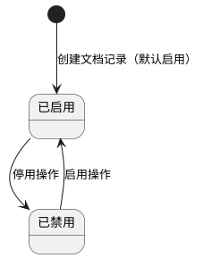
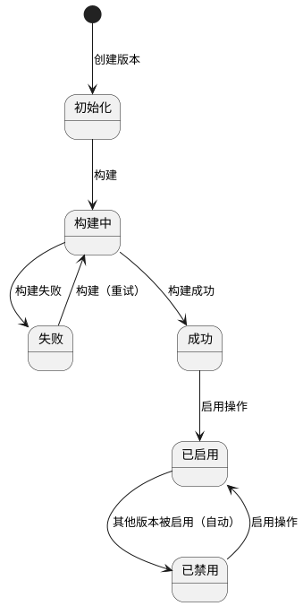
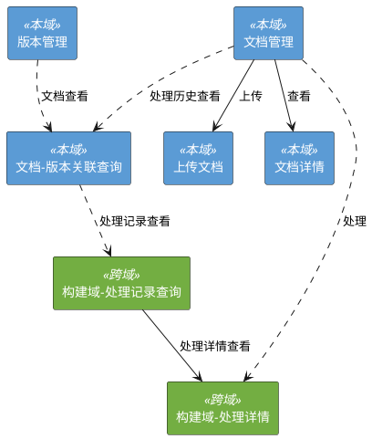

# 1. 状态迁移分析

## 1.1 文档状态迁移图

## 1.2 版本状态迁移图

# 2. 界面流转

# 3. 文档管理

## 3.1 文档列表

### 3.1.1 功能描述
系统提供文档列表的分页查询功能，支持按启用状态过滤及关键字搜索，默认按创建时间降序排列。

### 3.1.2 界面元素

**表 1 界面元素基本信息**

| 属性 | 值 |
| :--- | :--- |
| 界面名称 | 文档列表 |
| 界面类型 | 数据查询 |
| 展现方式 | 页面 |

**表 2 搜索栏**

| 字段名 | 输入方式 | 查询方式(P/EP/BP/AP) | 备注 |
| :--- | :--- | :--- | :--- |
| 关键字搜索 | text | AP | 对原始文件名、标题进行任意位置模糊匹配 |
| 启用状态 | singleSelect | P | 精准匹配，可选值： - 是 - 否 默认值：全部 |

**表 3 工具栏**

| 字段名 | 批量/单条(B/S/N) | 类型(P/PP/SR/SNR/C/V) | 功能 | 备注 |
| :--- | :--- | :--- | :--- | :--- |
| 上传 | N | P | 弹出上传对话框 | 始终可用 |
| 启用 | B | SR | 批量启用选中记录 | 未选中记录时置灰，悬停提示"请先选择一条记录" |
| 停用 | B | SR | 批量停用选中记录 | 未选中记录时置灰，悬停提示"请先选择一条记录" |
| 处理 | B | V | 调用构建域触发文档处理，打开处理详情视图 | 未选中记录时置灰，悬停提示"请先选择一条记录" |
| 处理历史查看 | S | P | 打开文档-版本关联查询弹出框 | 未选中或选中超过一条记录时置灰，悬停提示"请选择一条记录" |

**表 4 查询结果展现**
- 排序规则: created_at 降序

| 字段名 | 最大长度 | 选中栏展示(Y/N) | 备注 |
| :--- | :--- | :--- | :--- |
| 选择框 | - | N | 多选checkbox |
| 原始文件名 | 30 | Y | 超长截断，hover显示全文 |
| 标题 | 20 | N | 超长截断，hover显示全文 |
| 启用状态 | - | N | 开关展示 |
| 文件大小 | - | N | 格式化为KB/MB显示 |
| 创建时间 | - | N | YYYY-MM-DD HH:mm:ss格式 |

### 3.1.3 处理流程
1) 后台接收分页查询请求（page、page_size、关键字、启用状态）
2) 后台对关键字在原始文件名、标题字段进行任意位置模糊匹配
3) 后台按启用状态进行精准过滤
4) 后台按创建时间降序排列，返回分页结果

### 3.1.4 特殊需求
无

## 3.2 文档上传

### 3.2.1 功能描述
系统支持批量文件选择和并发上传，前端计算文件MD5哈希并本地去重，后端提供重复性校验接口和单文件上传API。

### 3.2.2 界面元素

**表 5 界面元素基本信息**

| 属性 | 值 |
| :--- | :--- |
| 界面名称 | 上传文档 |
| 界面类型 | 输入表单 |
| 展现方式 | 弹出框 |
| 上级界面 | 文档列表 |

**表 6 表单字段**

| 字段名 | 输入方式 | 存在性(M/C) | 必填(M/O) | 备注 |
| :--- | :--- | :--- | :--- | :--- |
| 文件选择 | fileUpload | M | M | 多文件选择+拖拽上传，支持文件夹，仅PDF/Word格式，accept=".pdf,.docx,.doc" |

**表 7 组件**

| 组件名 | 组件风格 | 备注 |
| :--- | :--- | :--- |
| 上传按钮 | Element Plus el-button | 确认上传后触发文件校验和上传流程 |
| 取消按钮 | Element Plus el-button | 关闭对话框 |

### 3.2.3 前置条件
- 不存在 构建中 状态的知识库版本
- 存在已启用的知识库版本，否则禁止上传

### 3.2.4 处理流程
1) 前端接收用户选择的文件列表，按全路径文件名升序排列
2) 前端批量计算每个文件的MD5哈希值，对相同哈希的文件进行本地去重
3) 后台接收重复性校验请求，校验每个文件的hash格式为32位十六进制、文件名不重复
4) 后台逐条查询document表中file_hash是否已存在，返回重复文件列表
5) 后台对不与后台重复的文件逐个上传
6) 后台读取文件内容并计算MD5哈希，验证前端提供的哈希与计算值一致
7) 后台验证文件格式（PDF/Word）和大小（<=100MB）
8) 后台将文件保存到MinIO存储（以MD5哈希为文件名）
9) 后台在PostgreSQL创建文档记录（状态=已启用，attempt_no=1）
10) 后台提交数据库事务，失败则回滚并尝试清理MinIO中的孤立文件
11) 后台查询当前启用的知识库版本，无则跳过处理（上传成功但提示需启用版本后手动处理）
12) 后台调用构建域异步触发文档处理任务

### 3.2.5 异常提示

**表 8 异常提示**

| 判断条件 | 提示信息 |
| :--- | :--- |
| 存在 构建中 状态的知识库版本 | 知识库版本正在构建中，暂不支持上传文档 |
| 选择文件为空 | 请选择文件 |
| 文件格式不是PDF/Word | 仅支持PDF、Word（.docx/.doc）格式 |
| 文件大小超过100MB | 文件大小不能超过100MB |
| 文件名长度超过255字符 | 文件名长度不能超过255个字符 |
| 前端MD5哈希与后端计算不一致 | 上传文件不完整 |
| 文件哈希与后台已有文件重复 | 与已上传文件"xxx"重复 |
| 多个文件哈希相同 | 与"xxx"文件重复 |
| MinIO存储失败 | 文件存储失败 |
| 数据库保存失败 | 文档保存失败 |
| 无启用的知识库版本 | 暂无启用的知识库版本，上传成功但未处理，请启用版本后手动处理 |

### 3.2.6 特殊需求
- 数据库保存失败时，系统自动尝试回滚删除已保存到MinIO的孤立文件

### 3.2.7 上传结果

#### 3.2.7.1 功能描述
系统展示批量上传结果，包括文件名、Hash、上传状态三列，支持失败文件重新上传。

#### 3.2.7.2 界面元素

**表 9 界面元素基本信息**

| 属性 | 值 |
| :--- | :--- |
| 界面名称 | 上传结果 |
| 界面类型 | 列表视图 |
| 展现方式 | 弹出框内（上传对话框中） |
| 上级界面 | 文档列表 |

**表 10 表单**

| 字段名 | 输入方式 | 存在性(M/C) | 必填(M/O) | 备注 |
| :--- | :--- | :--- | :--- | :--- |
| 文件名 | text | M | - | 按全路径名升序排列，只读 |
| Hash | text | M | - | spark-md5本地计算，32位十六进制，只读 |
| 上传结果 | text | M | - | 成功/失败/重复提示，失败支持重新上传 |

#### 3.2.7.3 处理流程
1) 前端展示文件名、Hash、上传结果三列表格
2) 前端按上传进度实时更新每行的结果状态
3) 前端对重复文件显示"与xxx文件重复"或"与已上传文件重复"
4) 前端对上传失败的文件提供重新上传按钮

#### 3.2.7.4 异常提示

**表 11 异常提示**

| 判断条件 | 提示信息 |
| :--- | :--- |
| 上传失败 | 上传失败，点击重新上传 |

#### 3.2.7.5 特殊需求
无

## 3.3 文档详情

### 3.3.1 功能描述
系统展示文档详细信息，包含文档元数据及从构建域查询的处理历史时间线。

### 3.3.2 界面元素

**表 12 界面元素基本信息**

| 属性 | 值 |
| :--- | :--- |
| 界面名称 | 文档详情 |
| 界面类型 | 详情 |
| 展现方式 | 弹出框 |
| 上级界面 | 文档列表 |

**表 13 表单**

| 字段名 | 存在性(M/C) | 备注 |
| :--- | :--- | :--- |
| 文档ID | M | 只读 |
| 原始文件名 | M | 只读 |
| 标题 | M | 只读 |
| 文件大小 | M | 只读，格式化为KB/MB |
| MD5哈希 | M | 只读 |
| 启用状态 | M | 只读 |
| 创建时间 | M | 只读 |
| 更新时间 | M | 只读 |

### 3.3.3 处理流程
1) 后台接收文档详情查询请求（document_id）
2) 后台查询document表获取文档元数据
3) 后台查询文档-版本关联记录，调用构建域查询处理历史时间线
4) 后台返回文档详情及处理历史

### 3.3.4 特殊需求
无

## 3.4 文档启用

### 3.4.1 功能描述
系统将指定文档的启用状态切换为 已启用，使其可参与知识库版本构建。

### 3.4.2 前置条件
- 不存在 构建中 状态的知识库版本
- 文档存在
- 文档未处于 已启用 状态

### 3.4.3 处理流程
1) 后台查询文档是否存在
2) 后台校验文档未处于 已启用 状态
3) 后台将启用状态设为 是，更新updated_at
4) 后台将对应文档在知识库中的数据（chunk、ES索引、Milvus向量、Neo4j关系）的 enabled 字段设为 true
5) 后台提交事务

### 3.4.4 异常提示

**表 14 异常提示**

| 判断条件 | 提示信息 |
| :--- | :--- |
| 存在 构建中 状态的知识库版本 | 知识库版本正在构建中，暂不支持启用文档 |
| 文档不存在 | 文档不存在 |
| 文档已启用 | 文档已启用，无需重复操作 |

### 3.4.5 特殊需求
无

## 3.5 文档停用

### 3.5.1 功能描述
系统将指定文档的启用状态切换为 已禁用，使其不参与知识库版本构建。

### 3.5.2 前置条件
- 不存在 构建中 状态的知识库版本
- 文档存在
- 文档未处于 已禁用 状态

### 3.5.3 处理流程
1) 后台查询文档是否存在
2) 后台校验文档未处于 已禁用 状态
3) 后台将启用状态设为 否，更新updated_at
4) 后台将对应文档在知识库中的数据（chunk、ES索引、Milvus向量、Neo4j关系）的 enabled 字段设为 false，不删除数据
5) 后台提交事务

### 3.5.4 异常提示

**表 15 异常提示**

| 判断条件 | 提示信息 |
| :--- | :--- |
| 存在 构建中 状态的知识库版本 | 知识库版本正在构建中，暂不支持停用文档 |
| 文档不存在 | 文档不存在 |
| 文档已停用 | 文档已停用，无需重复操作 |

### 3.5.5 特殊需求
无

# 4. 知识库版本管理

## 4.1 版本列表

### 4.1.1 功能描述
分页查询知识库版本列表，支持按状态过滤，按版本名称降序排列。

### 4.1.2 界面元素

**表 16 界面元素基本信息**

| 属性 | 值 |
| :--- | :--- |
| 界面名称 | 版本管理 |
| 界面类型 | 数据查询 |
| 展现方式 | 页面 |

**表 17 搜索栏**

| 字段名 | 输入方式 | 查询方式(P/EP/BP/AP) | 备注 |
| :--- | :--- | :--- | :--- |
| 状态 | singleSelect | P | 可选值： - 初始化 - 构建中 - 成功 - 已启用 - 已禁用 - 失败 默认值：全部 |

**表 18 工具栏**

| 字段名 | 批量/单条(B/S/N) | 类型(P/PP/SR/SNR/C/V) | 功能 | 备注 |
| :--- | :--- | :--- | :--- | :--- |
| 新建 | N | SR | 创建版本记录（状态=初始化） | 始终可用 |
| 构建 | S | SR | 遍历启用文档，调用构建域执行批量处理 | 仅选中 初始化 或 失败 版本时可用，未选中或选中超过一条时置灰 |
| 启用 | S | SR | 启用选中的版本 | 仅选中 成功 或 已禁用 版本时可用，未选中或选中超过一条时置灰 |
| 文档查看 | S | P | 打开文档-版本关联查询弹出框 | 未选中或选中超过一条记录时置灰，悬停提示"请选择一条记录" |

**表 19 查询结果展现**
- 排序规则: 版本名称 降序

| 字段名 | 最大长度 | 选中栏展示(Y/N) | 备注 |
| :--- | :--- | :--- | :--- |
| 选择框 | - | N | 单选 radio |
| 版本名称 | - | Y | 格式 v20260422_103000 |
| 状态 | - | N | 初始化 / 构建中 / 成功 / 已启用 / 已禁用 / 失败 |
| 文档数 | - | N | 该版本包含的文档数量 |
| 分块数 | - | N | 该版本包含的 chunk 总数 |
| 操作人 | 15 | N | 超长截断，hover 显示全文 |
| 开始时间 | - | N | YYYY-MM-DD HH:mm:ss 格式 |
| 完成时间 | - | N | 未完成时显示"-" |
| 创建时间 | - | N | YYYY-MM-DD HH:mm:ss 格式 |

### 4.1.3 特殊需求
无

## 4.2 版本新建

### 4.2.1 功能描述
创建新版本记录，状态初始化为 初始化。

### 4.2.2 前置条件
无

### 4.2.3 处理流程
1) 前端弹出确认框，用户确认后提交请求
2) 后台生成版本名称（v + 时间戳），创建版本记录（状态=初始化）
3) 后台返回版本名称和状态

### 4.2.4 异常提示

**表 20 异常提示**

| 判断条件 | 提示信息 |
| :--- | :--- |
| 数据库不可访问 | 数据库服务不可用 |

### 4.2.5 特殊需求
无

## 4.3 版本构建

### 4.3.1 功能描述
手动触发知识库构建，系统遍历当前所有已启用文档，调用构建域执行完整处理流水线。构建期间阻塞文档的上传/启用/停用/处理操作。

### 4.3.2 前置条件
- 目标版本存在
- 目标版本状态为 初始化 或 失败
- 不存在 构建中 状态的版本

### 4.3.3 处理流程
1) 前端弹出确认框，用户确认后提交请求
2) 后台查询目标版本，不存在则返回错误
3) 后台校验目标版本状态为 初始化 或 失败，不满足则返回错误
4) 后台检查是否存在 构建中 状态的版本，存在则拒绝
5) 后台将目标版本状态改为 构建中
6) 后台异步调用构建域批量处理所有已启用文档，全部完成后更新状态=成功，失败则更新状态=失败
7) 后台返回版本名称和状态

### 4.3.4 异常提示

**表 21 异常提示**

| 判断条件 | 提示信息 |
| :--- | :--- |
| 版本不存在 | 版本不存在 |
| 版本状态不是 初始化 或 失败 | 该版本无法构建，仅可构建 初始化 或 失败 状态的版本 |
| 版本已是 构建中 状态 | 该版本正在构建中，请等待完成后再操作 |
| 存在 构建中 状态的版本 | 已有版本正在构建中，请等待完成后再操作 |

### 4.3.5 特殊需求
无

## 4.4 版本启用

### 4.4.1 功能描述
启用指定版本，系统自动将当前启用版本改为 已禁用，将目标版本改为 已启用。

### 4.4.2 前置条件
- 目标版本存在
- 目标版本状态为 成功 或 已禁用
- 目标版本不是当前已启用的版本

### 4.4.3 处理流程
1) 前端弹出确认框，展示选中版本信息，用户确认后提交请求
2) 后台查询目标版本，不存在则返回错误
3) 后台校验目标版本状态为 成功 或 已禁用，不满足则返回错误
4) 后台查询当前启用版本，若存在则将其状态改为 已禁用
5) 后台将目标版本状态改为 已启用
6) 后台返回启用结果（含被替换的原版本名称）

### 4.4.4 异常提示

**表 22 异常提示**

| 判断条件 | 提示信息 |
| :--- | :--- |
| 版本不存在 | 版本不存在 |
| 版本状态不是 成功 或 已禁用 | 该版本无法启用，仅可启用 成功 或 已禁用 状态的版本 |
| 版本已是启用状态 | 该版本已是启用状态，无需重复操作 |

### 4.4.5 特殊需求
无

# 5. 文档-版本关联查询

## 5.1 功能描述
系统提供文档-版本关联列表的分页查询功能，作为查看文档处理进度的统一入口视图。支持按文档和版本两个维度过滤。

## 5.2 界面元素

**表 23 界面元素基本信息**

| 属性 | 值 |
| :--- | :--- |
| 界面名称 | 文档-版本关联查询 |
| 界面类型 | 数据查询 |
| 展现方式 | 弹出框 |
| 上级界面 | 文档列表 / 版本管理 |

**表 24 工具栏**

| 字段名 | 批量/单条(B/S/N) | 类型(P/PP/SR/SNR/C/V) | 功能 | 备注 |
| :--- | :--- | :--- | :--- | :--- |
| 处理记录查看 | S | P | 打开构建域处理记录列表（跨域弹出框） | 未选中或选中超过一条记录时置灰，悬停提示"请选择一条记录" |
| 处理详情查看 | S | V | 打开构建域处理详情多 tab 视图（跨域视图） | 未选中或选中超过一条记录时置灰，悬停提示"请选择一条记录" |

**表 25 查询结果展现**
- 排序规则: created_at 降序
- 过滤维度：
  - 来自文档管理入口：按 document_id 过滤
  - 来自版本管理入口：按 version_id 过滤

| 字段名 | 最大长度 | 选中栏展示(Y/N) | 备注 |
| :--- | :--- | :--- | :--- |
| 选择框 | - | N | 单选 checkbox |
| 文档名称 | 30 | Y | 超长截断，hover 显示全文 |
| 版本名称 | - | N | 格式 v20260422_103000 |
| 关联类型 | - | N | 可选值： - 初始构建 - 增量添加 - 重新处理 |
| 处理状态 | - | N | 可选值： - 待处理 - 处理中 - 成功 - 失败 |
| 创建时间 | - | N | YYYY-MM-DD HH:mm:ss 格式 |

## 5.3 处理流程
1) 后台接收分页查询请求（page、page_size、document_id 或 version_id）
2) 后台按 document_id 或 version_id 过滤 document_version_relation 表
3) 后台按 created_at 降序排列，返回分页结果

## 5.4 特殊需求
无

# 6. 其他需求

## 6.1 构建域交互
文档上传成功后，后台调用构建域异步触发文档处理任务。工具栏"处理"按钮调用构建域触发指定文档的处理。版本构建遍历所有已启用文档，逐条调用构建域执行处理流水线。文档详情中的处理历史时间线从构建域查询。

## 6.2 文档扫描
扫描 MinIO 存储桶识别无数据库记录的孤立文件。此功能 REQ 待补充。

## 6.3 文档清理日志
提供清理操作日志的分页查询。此功能 REQ 待补充。

# 7. 跨模块约束

- 上传完成、工具栏处理按钮、版本构建均调用构建域触发文档处理
- 文档详情、文档-版本关联查询中的处理历史数据来自构建域
- 构建域执行处理前需校验业务资源域的数据完整性（文档存在、文件可读）
- 文档启用/停用时更新知识库数据 enabled 字段，构建域写入数据时继承此字段值

# 8. 参考文档

[1] docs/OVERVIEW.md — 系统功能总览
[2] docs/ARCHITECTURE.md — 系统技术架构
[3] docs/CONTRACTS.md — 跨领域约束
