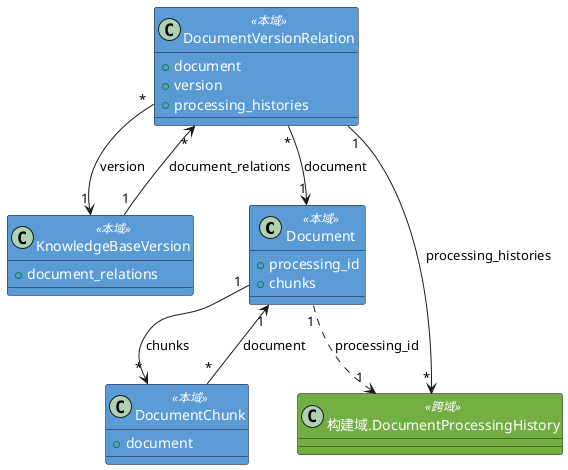
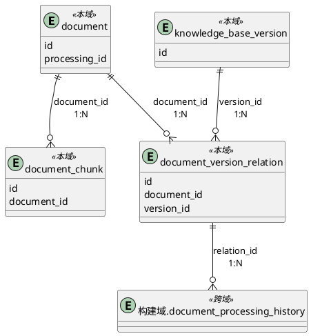

# 1. 领域类设计

## 1.1 类清单

| 类名 | 持久化(Y/N) | 备注 |
| :--- | :--- | :--- |
| resource.document.Document | Y | 文档领域对象 |
| resource.document.DocumentChunk | Y | 文档分块领域对象 |
| resource.version.KnowledgeBaseVersion | Y | 知识库版本领域对象 |
| resource.relation.DocumentVersionRelation | Y | 文档-版本关联领域对象 |

## 1.2 领域类详情

### 1.2.1 Document

**字段映射**

| 字段名 | 存储映射 | 备注 |
| :--- | :--- | :--- |
| id | id | 领域对象标识 |
| user_id | user_id | 上传用户ID（跨模块，仅存ID值，无外键） |
| title | title | 文档标题 |
| original_filename | original_filename | 原始文件名 |
| file_hash | file_hash | 文件MD5 |
| file_size | file_size | 文件大小（字节） |
| mime_type | mime_type | 文件MIME类型 |
| file_path | file_path | 文件存储路径（兼容旧字段） |
| status | status | 文档状态（已启用/已禁用） |
| processing_id | processing_id | 关联 构建域.DocumentProcessingHistory，当前处理任务ID（跨域引用） |
| attempt_no | attempt_no | 处理次数，>=1 |
| chunk_count | chunk_count | 分块数量 |
| total_token | total_token | 总token数量 |
| embedding_model | embedding_model | 向量嵌入模型 |
| language | language | 语言代码，默认zh |
| build_id | build_id | 关联的构建记录ID |
| created_at | created_at | 创建时间 |
| updated_at | updated_at | 更新时间 |
| processed_at | processed_at | 最后处理完成时间 |

**内部方法说明**

| 方法 | 入口 | 流程 |
| :--- | :--- | :--- |
| enable() | Document.enable() | 设置 status='enabled'，更新 updated_at |
| disable() | Document.disable() | 设置 status='disabled'，更新 updated_at |

#### DocumentStatus

| 页面文案 | 技术枚举 | 说明 |
| :--- | :--- | :--- |
| 已启用 | `ENABLED` | 启用状态 |
| 已禁用 | `DISABLED` | 停用状态 |

### 1.2.2 DocumentChunk

**字段映射**

| 字段名 | 存储映射 | 备注 |
| :--- | :--- | :--- |
| id | id | 领域对象标识 |
| document | document_id | 关联 Document，通过外键关联 |
| chunk_index | chunk_index | 分块序号 |
| original_text | original_text | 原始文本，调测用 |
| processed_text | processed_text | 处理后文本 |
| processed_text_token_count | processed_text_token_count | processed_text 的 token 数 |
| hypothetical_questions | hypothetical_questions | 假设性问题列表 |
| hypothetical_questions_token_count | hypothetical_questions_token_count | 拼接后文本的 token 数 |
| relations | relations | 关系三元组列表 |
| page_range_start | page_range_start | 起始页码 |
| page_range_end | page_range_end | 结束页码 |
| section_title | section_title | 所属章节标题 |

### 1.2.3 KnowledgeBaseVersion

**字段映射**

| 字段名 | 存储映射 | 备注 |
| :--- | :--- | :--- |
| id | id | 领域对象标识 |
| version_name | version_name | 版本名称（v20260422_103000） |
| status | status | 版本状态（初始化/构建中/成功/已启用/已禁用/失败） |
| document_count | document_count | 该版本包含的文档数量 |
| chunk_count | chunk_count | 该版本包含的 chunk 总数 |
| error_message | error_message | 失败原因 |
| created_by | created_by | 操作人 |
| started_at | started_at | 开始时间 |
| completed_at | completed_at | 完成时间 |
| created_at | created_at | 创建时间 |
| updated_at | updated_at | 更新时间 |

**内部方法说明**

| 方法 | 入口 | 流程 |
| :--- | :--- | :--- |
| start_build() | KnowledgeBaseVersion.start_build() | 校验 status 为 INIT 或 FAILED，设置 status=BUILDING，更新 started_at |
| complete_build(document_count, chunk_count) | KnowledgeBaseVersion.complete_build() | 校验 status 为 BUILDING，设置 status=SUCCEEDED、document_count、chunk_count、completed_at |
| fail_build(error_message) | KnowledgeBaseVersion.fail_build() | 校验 status 为 BUILDING，设置 status=FAILED、error_message、completed_at |
| enable() | KnowledgeBaseVersion.enable() | 校验 status 为 SUCCEEDED 或 DISABLED，设置 status=ENABLED |

#### VersionStatus

| 页面文案 | 技术枚举 | 说明 |
| :--- | :--- | :--- |
| 初始化 | `INIT` | 初始状态，刚创建未构建 |
| 构建中 | `BUILDING` | 构建进行中 |
| 成功 | `SUCCEEDED` | 构建成功 |
| 已启用 | `ENABLED` | 当前检索可见 |
| 已禁用 | `DISABLED` | 非当前版本 |
| 失败 | `FAILED` | 构建失败 |

### 1.2.4 DocumentVersionRelation

**字段映射**

| 字段名 | 存储映射 | 备注 |
| :--- | :--- | :--- |
| id | id | 领域对象标识 |
| document | document_id | 关联 Document，通过外键关联 |
| version | version_id | 关联 KnowledgeBaseVersion，通过外键关联 |
| processing_histories | - | 关联 构建域.DocumentProcessingHistory 集合，反向查询所有处理历史（跨域引用） |
| relation_type | relation_type | 关联类型（初始构建/增量添加/重新处理） |
| status | status | 处理状态（待处理/处理中/成功/失败） |
| stored | stored | 是否已入库可检索，默认 false |
| created_at | created_at | 创建时间 |
| updated_at | updated_at | 更新时间 |

#### RelationType

| 页面文案 | 技术枚举 | 说明 |
| :--- | :--- | :--- |
| 初始构建 | `INITIAL` | 版本构建时初始关联 |
| 增量添加 | `INCREMENTAL` | 版本构建后新增文档 |
| 重新处理 | `REPROCESSED` | 文档重新处理后关联 |

#### DocumentVersionStatus

| 页面文案 | 技术枚举 | 说明 |
| :--- | :--- | :--- |
| 待处理 | `PENDING` | 等待处理 |
| 处理中 | `PROCESSING` | 处理中 |
| 成功 | `SUCCEEDED` | 处理成功 |
| 失败 | `FAILED` | 处理失败 |

## 1.3 类图



# 2. 数据结构

## 2.1 表设计

### 2.1.1 表清单

| 表名 | 表中文名 | 备注 |
| :--- | :--- | :--- |
| document | 文档元数据表 | 存储文档元数据 |
| document_chunk | 文档分块表 | 存储文档处理后的分块内容 |
| knowledge_base_version | 知识库版本表 | 存储知识库版本元数据 |
| document_version_relation | 文档-版本关联表 | 记录文档与版本的关联关系 |

### 2.1.2 document 表

**表设计**

| 列名 | 类型 | 非空性(Y/N) | 备注 |
| :--- | :--- | :--- | :--- |
| id | BigInteger | N | 主键，自增 |
| user_id | BigInteger | Y | 上传用户ID（跨模块，仅存ID值，无外键） |
| title | String(500) | N | 文档标题 |
| original_filename | String(255) | N | 原始文件名 |
| file_hash | String(32) | N | 文件MD5哈希，32位十六进制，唯一 |
| file_size | BigInteger | Y | 文件大小（字节） |
| mime_type | String(100) | Y | 文件MIME类型 |
| file_path | String(500) | Y | 文件存储路径（兼容旧字段） |
| status | String(20) | N | 已启用/已禁用。存储映射：ENABLED→"enabled", DISABLED→"disabled" |
| processing_id | String(36) | Y | 当前处理任务ID，关联 构建域.document_processing_history.processing_id（跨域引用，无外键约束） |
| attempt_no | Integer | N | 处理次数，>=1 |
| chunk_count | Integer | N | 分块数量 |
| total_token | Integer | N | 总token数量 |
| embedding_model | String(50) | Y | 向量嵌入模型 |
| language | String(10) | N | 语言代码，默认zh |
| build_id | String(36) | Y | 关联的构建记录ID |
| created_at | TIMESTAMP | N | 创建时间，带时区 |
| updated_at | TIMESTAMP | N | 更新时间，带时区 |
| processed_at | TIMESTAMP | Y | 最后处理完成时间 |

**表约束**

| 约束名 | 类型 | 字段 | 说明 |
| :--- | :--- | :--- | :--- |
| pk_document | PK | id | 主键 |
| uk_document_file_hash | UNIQUE | file_hash | 文件哈希唯一 |

### 2.1.3 document_chunk 表

**表设计**

| 列名 | 类型 | 非空性(Y/N) | 备注 |
| :--- | :--- | :--- | :--- |
| id | BigInteger | N | 主键，自增 |
| document_id | BigInteger | N | 关联 document.id |
| chunk_index | Integer | N | 分块序号，从 0 递增 |
| original_text | Text | N | 原始文本，调测用 |
| processed_text | Text | N | 处理后文本 |
| processed_text_token_count | Integer | N | processed_text 的 token 数 |
| hypothetical_questions | JSONB | N | 假设性问题列表 |
| hypothetical_questions_token_count | Integer | N | 拼接后文本的 token 数 |
| relations | JSONB | N | 关系三元组列表 |
| page_range_start | Integer | N | 起始页码 |
| page_range_end | Integer | N | 结束页码 |
| section_title | String(500) | N | 所属章节标题 |

**表约束**

| 约束名 | 类型 | 字段 | 说明 |
| :--- | :--- | :--- | :--- |
| pk_document_chunk | PK | id | 主键 |
| fk_chunk_document_id_ref_document | FK | document_id → document.id | 关联文档 |
| uk_document_chunk_index | UNIQUE | document_id, chunk_index | 同一文档分块序号唯一 |

### 2.1.4 knowledge_base_version 表

**表设计**

| 列名 | 类型 | 非空性(Y/N) | 备注 |
| :--- | :--- | :--- | :--- |
| id | BigInteger | N | 主键，自增 |
| version_name | String(50) | N | 版本名称（v+时间戳），唯一 |
| status | String(20) | N | 版本状态。存储映射：INIT→"init", BUILDING→"building", SUCCEEDED→"succeeded", ENABLED→"enabled", DISABLED→"disabled", FAILED→"failed" |
| document_count | Integer | N | 包含的文档数，默认0 |
| chunk_count | Integer | N | 包含的chunk总数，默认0 |
| error_message | Text | Y | 失败时的错误信息 |
| created_by | String(100) | Y | 操作人 |
| started_at | TIMESTAMP | N | 开始时间 |
| completed_at | TIMESTAMP | Y | 完成时间 |
| created_at | TIMESTAMP | N | 创建时间 |
| updated_at | TIMESTAMP | N | 更新时间 |

**表约束**

| 约束名 | 类型 | 字段 | 说明 |
| :--- | :--- | :--- | :--- |
| pk_knowledge_base_version | PK | id | 主键 |
| uk_knowledge_base_version_version_name | UNIQUE | version_name | 版本名称唯一 |
| idx_kb_version_status | INDEX | status | 按状态过滤查询 |

### 2.1.5 document_version_relation 表

**表设计**

| 列名 | 类型 | 非空性(Y/N) | 备注 |
| :--- | :--- | :--- | :--- |
| id | BigInteger | N | 主键，自增 |
| document_id | BigInteger | N | 关联 document.id |
| version_id | BigInteger | N | 关联 knowledge_base_version.id |
| relation_type | String(20) | N | 关联类型。存储映射：INITIAL→"initial", INCREMENTAL→"incremental", REPROCESSED→"reprocessed" |
| status | String(20) | N | 处理状态。存储映射：PENDING→"pending", PROCESSING→"processing", SUCCEEDED→"succeeded", FAILED→"failed" |
| stored | Boolean | N | 是否已入库可检索，默认 false |
| created_at | TIMESTAMP | N | 创建时间 |
| updated_at | TIMESTAMP | N | 更新时间 |

**表约束**

| 约束名 | 类型 | 字段 | 说明 |
| :--- | :--- | :--- | :--- |
| pk_document_version_relation | PK | id | 主键 |
| fk_doc_ver_rel_document_id_ref_document | FK | document_id → document.id | 关联文档 |
| fk_doc_ver_rel_version_id_ref_kb_version | FK | version_id → knowledge_base_version.id | 关联版本 |
| uk_document_version | UNIQUE | document_id, version_id | 文档与版本关联唯一 |
| idx_doc_ver_relation_document | INDEX | document_id | 按文档查询 |
| idx_doc_ver_relation_version | INDEX | version_id | 按版本查询 |
| idx_doc_ver_relation_status | INDEX | status | 按状态查询 |

### 2.1.6 ER图



# 3. 事件设计

无（处理相关事件由构建域负责）

# 4. 后端功能设计

## 4.1 模块前缀

| 模块 | 入口路径 |
| :--- | :--- |
| 文档管理 | resource.document.api |
| 版本管理 | resource.version.api |
| 关联查询 | resource.relation.api |

## 4.2 异常枚举

**枚举类名**: `ResourceErrorCode`（Python 枚举成员名遵循 PEP 8，使用全大写）

| 枚举名 | 状态码 | 描述 |
| :--- | :--- | :--- |
| `DOCUMENT_NOT_FOUND` | 404001 | 文档不存在 |
| `VERSION_NOT_FOUND` | 404002 | 版本不存在 |
| `FILE_FORMAT_NOT_SUPPORTED` | 400001 | 仅支持PDF/Word格式 |
| `FILE_SIZE_EXCEEDED` | 400002 | 文件大小超过100MB限制 |
| `FILE_DUPLICATE` | 409001 | 文件哈希与已有记录重复 |
| `FILE_NAME_DUPLICATE` | 409003 | 文件名与已有记录重复 |
| `FILE_HASH_MISMATCH` | 400003 | 前端哈希与后端计算不一致 |
| `STORAGE_UNAVAILABLE` | 503001 | MinIO存储服务不可用 |
| `DATABASE_UNAVAILABLE` | 503002 | 数据库服务不可用 |
| `DOCUMENT_SAVE_FAILED` | 500002 | 文档持久化失败 |
| `DOCUMENT_ALREADY_ENABLED` | 001001 | 文档已启用，无需重复操作（警告码） |
| `DOCUMENT_ALREADY_DISABLED` | 001002 | 文档已停用，无需重复操作（警告码） |
| `VERSION_BUILDING_EXISTS` | 409002 | 已有版本正在构建中 |
| `VERSION_ALREADY_ENABLED` | 001004 | 该版本已是启用状态，无需重复操作（警告码） |
| `VERSION_CANNOT_BUILD` | 400005 | 该版本无法构建，仅可构建初始化或失败状态的版本 |
| `VERSION_CANNOT_ENABLE` | 400006 | 该版本无法启用，仅可启用成功或已禁用状态的版本 |
| `BUILDING_IN_PROGRESS` | 001004 | 知识库版本正在构建中，暂不支持此操作（警告码） |
| `NO_ENABLED_VERSION` | 404004 | 暂无启用的知识库版本，请先创建并启用一个版本 |
| `INVALID_PARAMETER` | 400004 | 参数校验失败 |

## 4.3 API清单

| 方法 | URL | 代码入口 | 名称 | 对应REQ章节 |
| :--- | :--- | :--- | :--- | :--- |
| POST | /resource/document/check | check | 文件重复性校验 | REQ #3.2 |
| POST | /resource/document/upload | upload | 单文件上传 | REQ #3.2 |
| GET | /resource/document/list | query | 文档列表分页查询 | REQ #3.1 |
| GET | /resource/document/detail | detail | 文档详情查询 | REQ #3.3 |
| PUT | /resource/document/enable | enable | 文档启用 | REQ #3.4 |
| PUT | /resource/document/disable | disable | 文档停用 | REQ #3.5 |
| POST | /resource/document/process | process | 文档处理触发 | REQ #6.1 |
| GET | /resource/version/list | query | 版本列表查询 | REQ #4.1 |
| POST | /resource/version/create | create | 版本新建 | REQ #4.2 |
| POST | /resource/version/build | build | 版本构建 | REQ #4.3 |
| PUT | /resource/version/enable | enable | 版本启用 | REQ #4.4 |
| GET | /resource/relation/list | query_relations | 文档-版本关联查询 | REQ #5 |

## 4.4 文件重复性校验

### 4.4.1 请求模型

| 字段 | 类型 | 必填 | 说明 |
| :--- | :--- | :--- | :--- |
| hashes | List[str] | M | 文件MD5哈希列表，32位十六进制 |

### 4.4.2 响应模型

```json
{
  "code": "000000",
  "description": "成功",
  "content": {
    "duplicates": [
      { "hash": "abc123...", "document_id": 1, "filename": "report.pdf" }
    ]
  }
}
```

### 4.4.3 处理流程

1) 校验请求体中每个文件的 hash 格式为32位十六进制
2) 查询 document 表中 file_hash 存在于请求列表中的记录
3) 返回重复文件列表（包含已存在文档ID和文件名）
4) 抛出异常：数据库不可访问时抛出 `DATABASE_UNAVAILABLE`，记录 ERROR 日志

## 4.5 单文件上传

### 4.5.1 请求模型

文件上传表单，multipart/form-data。

| 字段 | 类型 | 必填 | 说明 |
| :--- | :--- | :--- | :--- |
| file | File | M | PDF/Word文件，<=100MB |

### 4.5.2 响应模型

```json
{
  "code": "000000",
  "description": "成功",
  "content": {
    "document_id": 1,
    "original_filename": "report.pdf",
    "file_hash": "abc123...",
    "status": "success"
  }
}
```

### 4.5.3 处理流程

1) 读取上传文件内容，计算MD5哈希
2) 查询 knowledge_base_version 表是否存在 status='building' 的版本，存在则抛出 `BUILDING_IN_PROGRESS`
3) 校验文件格式，非PDF/Word则抛出 `FILE_FORMAT_NOT_SUPPORTED`
4) 校验文件大小，超过100MB则抛出 `FILE_SIZE_EXCEEDED`
5) 查询 document 表中 file_hash 是否已存在，存在则抛出 `FILE_DUPLICATE`
6) 将文件保存到 MinIO（以 MD5 哈希为文件名），保存失败则抛出 `STORAGE_UNAVAILABLE`，记录 ERROR 日志
7) 开启数据库事务：INSERT document 记录（status='enabled', attempt_no=1）
8) 提交事务，提交失败则回滚并尝试从 MinIO 删除已写入的孤立文件，抛出 `DOCUMENT_SAVE_FAILED`
9) 查询 knowledge_base_version 表是否存在 status='enabled' 的版本，不存在则返回警告码 `NO_ENABLED_VERSION`（上传成功但未处理，后续需手动触发）
10) 调用构建域异步触发文档处理任务（传递 document_id），触发失败记录 ERROR 日志不影响主流程

## 4.6 文档列表分页查询

### 4.6.1 请求模型

| 字段 | 类型 | 必填 | 说明 |
| :--- | :--- | :--- | :--- |
| page | Integer | M | 页码，默认1 |
| page_size | Integer | M | 每页数量，默认20 |
| search | String | O | 关键字搜索 |
| status | String | O | 状态过滤，可选值：<br>- 是<br>- 否<br>默认值：全部 |

### 4.6.2 响应模型

```json
{
  "code": "000000",
  "description": "成功",
  "content": {
    "data": [...],
    "total": 100,
    "page": 1,
    "page_size": 20,
    "total_pages": 5
  }
}
```

### 4.6.3 处理流程

1) 接收分页参数（page, page_size）和过滤条件（关键字、状态）
2) 对关键字在 original_filename、title 字段进行任意位置模糊匹配
3) 按状态进行精准过滤
4) 按 created_at 降序排列，返回分页结果
5) 抛出异常：数据库不可访问时抛出 `DATABASE_UNAVAILABLE`，记录 ERROR 日志

## 4.7 文档详情查询

### 4.7.1 请求模型

| 字段 | 类型 | 必填 | 说明 |
| :--- | :--- | :--- | :--- |
| document_id | BigInteger | M | 文档ID |

### 4.7.2 响应模型

```json
{
  "code": "000000",
  "description": "成功",
  "content": {
    "document": { ... },
    "processing_history": [ ... ]
  }
}
```

### 4.7.3 处理流程

1) 查询 document 表获取文档元数据，不存在则抛出 `DOCUMENT_NOT_FOUND`
2) 查询 document_version_relation 表获取该文档的所有关联记录
3) 通过关联记录调用构建域查询处理历史时间线，按 attempt_no 降序
4) 返回文档详情及处理历史
5) 抛出异常：数据库不可访问时抛出 `DATABASE_UNAVAILABLE`，记录 ERROR 日志

## 4.8 文档启用

### 4.8.1 请求模型

| 字段 | 类型 | 必填 | 说明 |
| :--- | :--- | :--- | :--- |
| document_ids | List[BigInteger] | M | 文档ID列表 |

### 4.8.2 响应模型

```json
{
  "code": "000000",
  "description": "成功",
  "content": {
    "results": [
      { "id": 1, "status": "success" },
      { "id": 2, "status": "failed", "reason": "文档已启用，无需重复操作" }
    ]
  }
}
```

### 4.8.3 处理流程

1) 校验 document_ids 不为空
2) 查询 knowledge_base_version 表是否存在 status='building' 的版本，存在则抛出 `BUILDING_IN_PROGRESS`
3) 遍历每个 document_id：
   - 查询文档是否存在，不存在则记录 `DOCUMENT_NOT_FOUND`
   - 校验文档未处于 enabled 状态，已启用则记录警告码 `DOCUMENT_ALREADY_ENABLED`
   - UPDATE document 设置 status='enabled'，更新 updated_at
   - 将该文档在知识库中的数据（chunk、ES索引、Milvus向量、Neo4j关系）的 enabled 字段设为 true
4) 提交事务，提交失败则抛出 `DATABASE_UNAVAILABLE`
5) 返回每条记录的启用结果

## 4.9 文档停用

### 4.9.1 请求模型

| 字段 | 类型 | 必填 | 说明 |
| :--- | :--- | :--- | :--- |
| document_ids | List[BigInteger] | M | 文档ID列表 |

### 4.9.2 响应模型

```json
{
  "code": "000000",
  "description": "成功",
  "content": {
    "results": [
      { "id": 1, "status": "success" },
      { "id": 2, "status": "failed", "reason": "文档已停用，无需重复操作" }
    ]
  }
}
```

### 4.9.3 处理流程

1) 校验 document_ids 不为空
2) 查询 knowledge_base_version 表是否存在 status='building' 的版本，存在则抛出 `BUILDING_IN_PROGRESS`
3) 遍历每个 document_id：
   - 查询文档是否存在，不存在则记录 `DOCUMENT_NOT_FOUND`
   - 校验文档未处于 disabled 状态，已停用则记录警告码 `DOCUMENT_ALREADY_DISABLED`
   - UPDATE document 设置 status='disabled'，更新 updated_at
   - 将该文档在知识库中的数据（chunk、ES索引、Milvus向量、Neo4j关系）的 enabled 字段设为 false，不删除数据
4) 提交事务，提交失败则抛出 `DATABASE_UNAVAILABLE`
5) 返回每条记录的停用结果

## 4.10 文档处理触发

由业务资源域（文档上传完成、工具栏"处理"按钮）和版本构建流程调用。本接口负责前置校验与关联记录管理，随后委托构建域执行处理流水线。

### 4.10.1 请求模型

| 字段 | 类型 | 必填 | 说明 |
| :--- | :--- | :--- | :--- |
| document_ids | List[BigInteger] | M | 文档ID列表 |

### 4.10.2 响应模型

```json
{
  "code": "000000",
  "description": "成功",
  "content": {
    "results": [
      { "id": 1, "status": "success", "processing_id": "xxx-xxx" },
      { "id": 2, "status": "failed", "reason": "文档正在处理中" }
    ]
  }
}
```

### 4.10.3 处理流程

1) 校验 document_ids 不为空
2) 查询 knowledge_base_version 表当前启用的版本（status='enabled'），不存在则抛出 `NO_ENABLED_VERSION`
3) 查询 knowledge_base_version 表是否存在 status='building' 的版本，存在则抛出 `BUILDING_IN_PROGRESS`
4) 遍历每个 document_id：
   - 查询 document 表获取文档记录，不存在则记录 `DOCUMENT_NOT_FOUND`
   - 查询 document_version_relation 表获取该文档在当前启用版本下的关联记录，不存在则自动创建（relation_type='INCREMENTAL', status='PENDING'）
   - UPDATE document 设置 processing_id 和 attempt_no
5) 调用构建域执行文档处理任务（传递 document_id、relation_id），触发失败记录 ERROR 日志
6) 返回每条记录的处理结果

## 4.11 版本列表查询

### 4.11.1 请求模型

| 字段 | 类型 | 必填 | 校验规则 |
| :--- | :--- | :--- | :--- |
| page | Integer | M | >=1，默认1 |
| page_size | Integer | M | >=1，<=100，默认20 |
| status | String | O | 状态过滤，可选值：<br>- 初始化<br>- 构建中<br>- 成功<br>- 已启用<br>- 已禁用<br>- 失败<br>默认值：全部 |

### 4.11.2 响应模型

```json
{
  "code": "000000",
  "description": "成功",
  "content": {
    "data": [
      {
        "id": 1,
        "version_name": "v20260422_103000",
        "status": "已启用",
        "document_count": 15,
        "chunk_count": 120,
        "created_by": "admin",
        "started_at": "2026-04-22T10:30:00+08:00",
        "completed_at": "2026-04-22T11:00:00+08:00",
        "created_at": "2026-04-22T10:30:00+08:00"
      }
    ],
    "total": 100,
    "page": 1,
    "page_size": 20,
    "total_pages": 5
  }
}
```

### 4.11.3 处理流程

1) 接收分页参数和可选 status 过滤条件
2) 若有 status 过滤，校验值为有效状态枚举
3) 查询 knowledge_base_version 表，按 version_name 降序排列
4) 返回分页结果
5) 抛出异常：数据库不可访问时抛出 `DATABASE_UNAVAILABLE`，记录 ERROR 日志

## 4.12 版本新建

### 4.12.1 请求模型

| 字段 | 类型 | 必填 | 校验规则 |
| :--- | :--- | :--- | :--- |
| created_by | String | O | 最大100字符 |

### 4.12.2 响应模型

```json
{
  "code": "000000",
  "description": "成功",
  "content": {
    "version_name": "v20260422_103000",
    "status": "初始化"
  }
}
```

### 4.12.3 处理流程

1) 生成版本名称（v + 当前时间戳 yyyyMMdd_HHmmss）
2) INSERT knowledge_base_version 记录（status='init', version_name, created_by, started_at=now）
3) 返回版本名称和状态
4) 抛出异常：数据库不可访问时抛出 `DATABASE_UNAVAILABLE`，记录 ERROR 日志

## 4.13 版本构建

### 4.13.1 请求模型

| 字段 | 类型 | 必填 | 校验规则 |
| :--- | :--- | :--- | :--- |
| version_name | String | M | 版本名称 |

### 4.13.2 响应模型

```json
{
  "code": "000000",
  "description": "成功",
  "content": {
    "version_name": "v20260422_103000",
    "status": "构建中"
  }
}
```

### 4.13.3 处理流程

1) 通过 version_name 查询 knowledge_base_version 表，不存在则抛出 `VERSION_NOT_FOUND`
2) 校验版本状态为 INIT 或 FAILED，不满足则抛出 `VERSION_CANNOT_BUILD`
3) 查询 knowledge_base_version 表是否存在 status='building' 的记录，存在则抛出 `VERSION_BUILDING_EXISTS`
4) UPDATE knowledge_base_version 设置 status='building'，更新 started_at
5) 后台异步触发构建任务（参见 4.13.4），返回版本名称和状态
6) 抛出异常：数据库不可访问时抛出 `DATABASE_UNAVAILABLE`，记录 ERROR 日志

### 4.13.4 构建任务

**输入**：version_name

**处理流程**

1) 通过 version_name 查询 knowledge_base_version 获取版本记录
2) 查询 document 表中所有 status='enabled' 的文档
3) 遍历每个启用文档：
   - 创建 document_version_relation（version_id, document_id, relation_type='INITIAL', status='PENDING'）
   - 调用构建域执行处理流水线（传递 document_id、relation_id）
   - 处理成功：更新 relation 状态为 SUCCEEDED
   - 处理失败：更新 relation 状态为 FAILED，记录 error_message
4) 统计结果：汇总 document_count（成功文档数）、chunk_count（成功分块总数）
5) 全部文档处理完成后：
   - 全部成功：UPDATE knowledge_base_version 设置 status='succeeded', document_count, chunk_count, completed_at
   - 存在失败：UPDATE knowledge_base_version 设置 status='failed', error_message, completed_at
6) 抛出异常：数据库不可访问时抛出 `DATABASE_UNAVAILABLE`

**中间结果**：无（流水线终点，各文档处理结果记录在 document_version_relation 和构建域表中）

## 4.14 版本启用

### 4.14.1 请求模型

| 字段 | 类型 | 必填 | 校验规则 |
| :--- | :--- | :--- | :--- |
| version_name | String | M | 版本名称 |

### 4.14.2 响应模型

```json
{
  "code": "000000",
  "description": "成功",
  "content": {
    "version_name": "v20260422_103000",
    "status": "已启用",
    "previous_version": "v20260421_150000"
  }
}
```

### 4.14.3 处理流程

1) 通过 version_name 查询 knowledge_base_version 表，不存在则抛出 `VERSION_NOT_FOUND`
2) 校验目标版本状态为 SUCCEEDED 或 DISABLED，不满足则抛出 `VERSION_CANNOT_ENABLE`
3) 校验目标版本不是当前已启用版本（status 已为 ENABLED），若是则抛出 `VERSION_ALREADY_ENABLED`
4) 开启事务：
   - 查询 knowledge_base_version 表中 status='enabled' 的当前启用版本
   - 若存在：UPDATE 该版本设置 status='disabled'
   - UPDATE 目标版本设置 status='enabled'
5) 提交事务，失败则回滚并抛出 `DATABASE_UNAVAILABLE`
6) 返回启用结果（含被替换的原版本名称）
7) 抛出异常：数据库不可访问时抛出 `DATABASE_UNAVAILABLE`，记录 ERROR 日志

## 4.15 文档-版本关联查询

### 4.15.1 请求模型

| 字段 | 类型 | 必填 | 说明 |
| :--- | :--- | :--- | :--- |
| page | Integer | M | 页码，默认1 |
| page_size | Integer | M | 每页数量，默认20 |
| document_id | Integer | O | 按文档过滤（文档管理入口） |
| version_id | Integer | O | 按版本过滤（版本管理入口） |

### 4.15.2 响应模型

```json
{
  "code": "000000",
  "description": "成功",
  "content": {
    "data": [
      {
        "id": 1,
        "document_id": 1,
        "document_name": "report.pdf",
        "version_id": 1,
        "version_name": "v20260422_103000",
        "relation_type": "初始构建",
        "status": "成功",
        "attempt_count": 2,
        "created_at": "2026-04-22T10:30:00+08:00"
      }
    ],
    "total": 50,
    "page": 1,
    "page_size": 20,
    "total_pages": 3
  }
}
```

### 4.15.3 处理流程

1) 接收分页参数和过滤条件（document_id 或 version_id）
2) 查询 document_version_relation 表，按 document_id 或 version_id 过滤
3) JOIN document 表获取 document_name，JOIN knowledge_base_version 表获取 version_name
4) 按 created_at 降序排列，返回分页结果
5) 抛出异常：数据库不可访问时抛出 `DATABASE_UNAVAILABLE`，记录 ERROR 日志

# 5. 跨模块约束

## 5.1 构建域交互

- 文档上传完成后，调用构建域异步触发文档处理任务
- 工具栏"处理"按钮调用构建域触发指定文档的处理
- 版本构建遍历所有已启用文档，逐条调用构建域执行处理流水线
- 文档详情中的处理历史时间线从构建域查询
- 构建域执行处理前需校验业务资源域的数据完整性（文档存在、文件可读）
- 文档启用/停用时更新知识库数据 enabled 字段，构建域写入数据时继承此字段值

## 5.2 上传写入顺序与文件清理一致性

- **涉及子模块**：上传、文件清理
- **约束内容**：写入顺序为 MinIO 先、DB 后，清理方向必须与写入方向一致——仅扫描"MinIO 有文件但 DB 无记录"并删除孤立文件，不反向处理
- **原因**：防止进程崩溃/超时导致的 MinIO 孤儿文件累积
