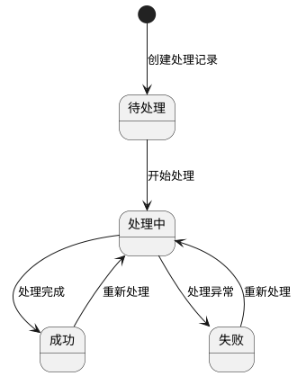
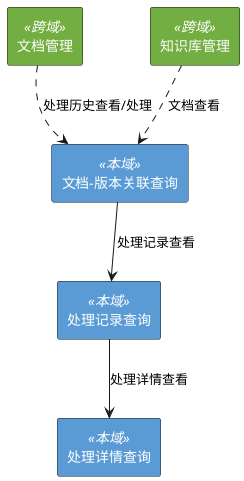

# 1. 状态迁移分析

## 1.1 处理记录状态迁移图

# 2. 界面流转

# 3. 文档-版本关联查询

## 3.1 功能描述
系统提供文档-版本关联列表的分页查询功能，支持按文档和版本两个维度过滤。作为文档管理和知识库管理的共享入口视图，文档管理模块按文档ID过滤，知识库管理模块按版本ID过滤。

## 3.2 界面元素

**表 1 界面元素基本信息**

| 属性 | 值 |
| :--- | :--- |
| 界面名称 | 文档-版本关联查询 |
| 界面类型 | 数据查询 |
| 展现方式 | 弹出框 |
| 上级界面 | 文档列表 / 版本管理 |

**表 2 文档-版本关联查询的工具栏**

| 字段名 | 批量/单条(B/S/N) | 类型(P/PP/SR/SNR/C/V) | 功能 | 备注 |
| :--- | :--- | :--- | :--- | :--- |
| 处理记录查看 | S | P | 打开处理记录列表 | 未选中或选中超过一条记录时置灰，悬停提示"请选择一条记录" |
| 处理详情查看 | S | V | 打开处理详情多 tab 视图 | 未选中或选中超过一条记录时置灰，悬停提示"请选择一条记录" |

**表 3 文档-版本关联查询的查询结果展现**
- 排序规则: created_at 降序
- 过滤维度：
  - 来自文档管理入口：按 document_id 过滤
  - 来自知识库管理入口：按 version_id 过滤

| 字段名 | 最大长度 | 选中栏展示(Y/N) | 备注 |
| :--- | :--- | :--- | :--- |
| 选择框 | - | N | 单选 checkbox |
| 文档名称 | 30 | Y | 超长截断，hover 显示全文 |
| 版本名称 | - | N | 格式 v20260422_103000 |
| 关联类型 | - | N | 可选值： - 初始构建 - 增量添加 - 重新处理 |
| 处理状态 | - | N | 可选值： - 待处理 - 处理中 - 成功 - 失败 |
| 创建时间 | - | N | YYYY-MM-DD HH:mm:ss 格式 |

## 3.3 处理流程

1) 后台接收分页查询请求（page、page_size、document_id 或 version_id）
2) 后台按 document_id 或 version_id 过滤 document_version_relation 表
3) 后台按 created_at 降序排列，返回分页结果

## 3.4 特殊需求
无

# 4. 文档处理

## 4.1 功能描述
系统触发文档的完整处理流水线（解析→清洗→分块→入库）。针对已有文档可重新处理，是处理流程的容错封装。

## 4.2 前置条件
- 不存在 构建中 状态的知识库版本
- 文档存在
- 该文档关联的版本中不存在 处理中 状态的处理记录

## 4.3 处理流程

1) 系统查询文档是否存在
2) 系统查询该文档在当前启用版本下的关联记录（document_version_relation），不存在则自动创建
3) 系统校验关联记录中不存在 处理中 状态的处理记录
4) 系统创建新的处理记录（状态=待处理）
5) 系统异步触发文档处理任务

## 4.4 异常提示

**表 4 异常提示**

| 判断条件 | 提示信息 |
| :--- | :--- |
| 存在 构建中 状态的知识库版本 | 知识库版本正在构建中，暂不支持触发文档处理 |
| 文档不存在 | 文档不存在 |
| 存在 处理中 状态的关联记录 | 文档正在处理中，请稍后再试 |

## 4.5 特殊需求
无

# 5. 处理记录查询

## 5.1 功能描述
系统提供指定关联记录的处理历史分页查询功能，支持查看处理编号、状态、处理时间等信息。

## 5.2 界面元素

**表 5 界面元素基本信息**

| 属性 | 值 |
| :--- | :--- |
| 界面名称 | 处理记录查询 |
| 界面类型 | 数据查询 |
| 展现方式 | 弹出框 |
| 上级界面 | 文档-版本关联查询 |

**表 6 处理记录的搜索栏**

| 字段名 | 输入方式 | 查询方式(P/EP/BP/AP) | 备注 |
| :--- | :--- | :--- | :--- |
| 无 | - | - | 默认显示该关联记录的所有处理记录 |

**表 7 处理记录的工具栏**

| 字段名 | 批量/单条(B/S/N) | 类型(P/PP/SR/SNR/C/V) | 功能 | 备注 |
| :--- | :--- | :--- | :--- | :--- |
| 处理详情查看 | S | V | 打开处理详情多 tab 视图 | 未选中或选中超过一条记录时置灰，悬停提示"请选择一条记录" |

**表 8 处理记录的查询结果展现**
- 排序规则: attempt_no 降序

| 字段名 | 最大长度 | 选中栏展示(Y/N) | 备注 |
| :--- | :--- | :--- | :--- |
| 选择框 | - | N | 单选 checkbox |
| 处理编号 | - | Y | 正整数，从 1 递增 |
| 处理状态 | - | N | 可选值： - 待处理 - 处理中 - 成功 - 失败 |
| 开始时间 | - | N | YYYY-MM-DD HH:mm:ss 格式 |
| 完成时间 | - | N | YYYY-MM-DD HH:mm:ss 格式，进行中时显示"-" |
| 错误信息 | 50 | N | 超长截断，hover 显示全文，成功时为"-" |

## 5.3 处理流程

1) 系统接收视图请求，参数为选中的 relation_id
2) 系统查询 document_processing_history 表获取该关联记录的所有处理记录
3) 系统按 attempt_no 降序返回分页结果

## 5.4 异常提示

**表 9 异常提示**

| 判断条件 | 提示信息 |
| :--- | :--- |
| 数据库不可访问 | 数据库服务不可用 |

## 5.5 特殊需求
无

# 6. 处理详情查询

## 6.1 功能描述
系统以多 tab 视图展示文档处理流水线的实时进度，每个 tab 对应一个文档的处理过程，支持查看各阶段的运行状态和结果。同时提供单个处理记录的阶段详情查询。

## 6.2 界面元素

**表 10 界面元素基本信息**

| 属性 | 值 |
| :--- | :--- |
| 界面名称 | 处理详情查询 |
| 界面类型 | 详情 |
| 展现方式 | 弹出框 |
| 上级界面 | 处理记录查询 / 文档-版本关联查询 |

**表 11 处理详情的表单**

| 字段名 | 存在性(M/C) | 备注 |
| :--- | :--- | :--- |
| 文档名称 | M | 只读 |
| 处理编号 | M | 只读 |
| 阶段进度 | M | 只读，以进度条+阶段名称展示（check→parse→clean→chunk→describe→store） |
| 当前状态 | M | 只读，可选值： - 处理中 - 成功 - 失败 |
| 错误信息 | C | 只读，当状态为 失败 时存在 |

## 6.3 处理流程

1) 系统接收视图请求，参数为选中的 relation_id（可多个，每个一个 tab）或 processing_id
2) 系统查询 document_processing_history 和 processing_stage_result 表获取各阶段状态
3) 系统返回各文档处理过程的进度和状态信息

## 6.4 异常提示

**表 12 异常提示**

| 判断条件 | 提示信息 |
| :--- | :--- |
| 数据库不可访问 | 数据库服务不可用 |

## 6.5 特殊需求
无

# 7. 其他需求

## 7.1 处理流水线

文档处理流水线包含六个阶段：检查（check）→ 解析（parsed）→ 清洗（cleaned）→ 图片描述（images_described）→ 分块（chunked）→ 数据入库（stored）。每个阶段完成时记录阶段结果（processing_stage_result），包含状态、耗时和中间结果路径。数据入库阶段开始时，系统先将 document_version_relation.stored 设为 false（标记数据不可检索），清理旧数据后写入新数据，写入成功后将 stored 设为 true。数据写入知识库时携带 enabled 元数据字段，其值继承当前文档的启用状态。

## 7.2 实时进度推送

处理流水线各阶段通过 SSE 实时推送进度事件，前端处理详情页面通过订阅对应 processing_id 的事件流展示进度。

# 8. 跨模块约束

无

# 9. 参考文档

[1] docs/OVERVIEW.md — 系统功能总览
[2] docs/文档管理/1.requirement.md — 文档管理需求
[3] docs/知识库管理/1.requirement.md — 知识库管理需求
