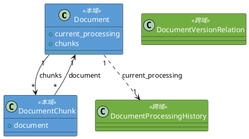
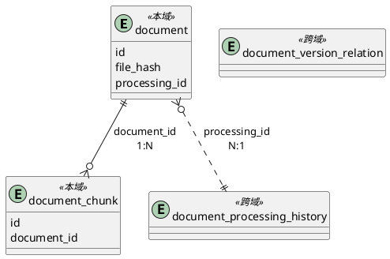

---
title: 文档管理
---

# 1. 领域类设计

## 1.1 类清单

| 类名 | 持久化(Y/N) | 备注 |
| :--- | :--- | :--- |
| admin.document.domain.Document | Y | 文档领域对象 |
| admin.document.domain.DocumentChunk | Y | 文档分块领域对象 |

## 1.2 领域类详情

### 1.2.1 Document

**字段映射**

| 字段名 | 存储映射 | 备注 |
| :--- | :--- | :--- |
| id | id | 领域对象标识 |
| file_hash | file_hash | 文件MD5 |
| original_filename | original_filename | 原始文件名 |
| status | status | 文档状态（已启用/已禁用） |
| current_processing | processing_id | 关联文档处理管理.DocumentProcessingHistory，通过外键关联（跨领域引用），指向当前处理记录 |

**内部方法说明**

| 方法 | 入口 | 流程 |
| :--- | :--- | :--- |
| enable() | Document.enable() | 设置 status='enabled'，更新 updated_at |
| disable() | Document.disable() | 设置 status='disabled'，更新 updated_at |

#### DocumentStatus

| 页面文案 | 技术枚举 | 说明 |
| :--- | :--- | :--- |
| 已启用 | `ENABLED` | 启用状态 |
| 已禁用 | `DISABLED` | 停用状态 |

### 1.2.2 ChunkResult

| 字段名 | 类型 | 备注 |
| :--- | :--- | :--- |
| original_text | str | 原始文本 |
| processed_text | str | 处理后文本 |
| hypothetical_questions | List[str] | 假设性问题列表（HyDE） |
| relations | List[Tuple[str,str,str]] | 关系三元组 |
| page_range | Tuple[int,int] | 页码范围 |
| section_title | str | 所属章节标题 |

### 1.2.5 ParseResult

| 字段名 | 类型 | 备注 |
| :--- | :--- | :--- |
| sections | List[ParsedSection] | 章节段落列表 |
| text_elements | List[ParsedText] | 纯文本元素 |
| image_elements | List[ParsedImage] | 图片元数据 |
| table_elements | List[ParsedTable] | 表格数据 |

### 1.2.6 DocumentChunk

**字段映射**

| 字段名 | 存储映射 | 备注 |
| :--- | :--- | :--- |
| id | id | 领域对象标识 |
| document | document_id | 关联 Document，通过外键关联 |
| chunk_index | chunk_index | 分块序号 |
| original_text | original_text | 原始文本，调测用 |
| processed_text | processed_text | 处理后文本 |
| processed_text_token_count | processed_text_token_count | processed_text 的 token 数 |
| hypothetical_questions | hypothetical_questions | 假设性问题列表 |
| hypothetical_questions_token_count | hypothetical_questions_token_count | 拼接后文本的 token 数 |
| relations | relations | 关系三元组列表 |
| page_range | page_range_start, page_range_end | 页码范围 |
| section_title | section_title | 所属章节标题 |

## 1.3 类图



# 2. 数据结构

## 2.1 表设计

### 2.1.1 表清单

| 表名 | 表中文名 | 备注 |
| :--- | :--- | :--- |
| document | 文档元数据表 | 存储文档元数据 |
| document_chunk | 文档分块表 | 存储文档处理后的分块内容 |

### 2.1.2 document 表

**表设计**

| 列名 | 类型 | 非空性(Y/N) | 备注 |
| :--- | :--- | :--- | :--- |
| id | BigInteger | N | 主键，自增 |
| user_id | BigInteger | Y | 上传用户ID（跨模块，仅存ID值，无外键） |
| title | String(500) | N | 文档标题 |
| original_filename | String(255) | N | 原始文件名 |
| file_hash | String(32) | N | 文件MD5哈希，32位十六进制，唯一 |
| file_size | BigInteger | Y | 文件大小（字节） |
| mime_type | String(100) | Y | 文件MIME类型 |
| file_path | String(500) | Y | 文件存储路径（兼容旧字段） |
| status | String(20) | N | 已启用/已禁用。存储映射：ENABLED→"enabled", DISABLED→"disabled" |
| processing_id | String(36) | Y | 当前处理任务ID |
| attempt_no | Integer | N | 处理次数，>=1 |
| chunk_count | Integer | N | 分块数量 |
| total_token | Integer | N | 总token数量 |
| embedding_model | String(50) | Y | 向量嵌入模型 |
| language | String(10) | N | 语言代码，默认zh |
| build_id | String(36) | Y | 关联的构建记录ID |
| created_at | TIMESTAMP | N | 创建时间，带时区 |
| updated_at | TIMESTAMP | N | 更新时间，带时区 |
| processed_at | TIMESTAMP | Y | 最后处理完成时间 |

**表约束**

| 约束名 | 类型 | 字段 | 说明 |
| :--- | :--- | :--- | :--- |
| pk_document | PK | id | 主键 |
| uk_document_file_hash | UNIQUE | file_hash | 文件哈希唯一 |
| fk_document_processing_id_ref_history | FK | processing_id → 文档处理管理.document_processing_history.processing_id | 当前处理任务（跨领域引用） |

### 2.1.3 document_chunk 表

**表设计**

| 列名 | 类型 | 非空性(Y/N) | 备注 |
| :--- | :--- | :--- | :--- |
| id | BigInteger | N | 主键，自增 |
| document_id | BigInteger | N | 关联 document.id |
| chunk_index | Integer | N | 分块序号，从 0 递增 |
| original_text | Text | N | 原始文本，调测用 |
| processed_text | Text | N | 处理后文本 |
| processed_text_token_count | Integer | N | processed_text 的 token 数 |
| hypothetical_questions | JSONB | N | 假设性问题列表 |
| hypothetical_questions_token_count | Integer | N | 拼接后文本的 token 数 |
| relations | JSONB | N | 关系三元组列表 |
| page_range_start | Integer | N | 起始页码 |
| page_range_end | Integer | N | 结束页码 |
| section_title | String(500) | N | 所属章节标题 |

**表约束**

| 约束名 | 类型 | 字段 | 说明 |
| :--- | :--- | :--- | :--- |
| pk_document_chunk | PK | id | 主键 |
| fk_chunk_document_id_ref_document | FK | document_id → document.id | 关联文档 |
| uk_document_chunk_index | UNIQUE | document_id, chunk_index | 同一文档分块序号唯一 |

### 2.1.4 ER图



# 3. 事件设计

无（处理相关事件由文档处理管理模块负责）

# 4. 后端功能设计

## 4.1 模块前缀

| 模块 | 入口路径 |
| :--- | :--- |
| 文档管理 | admin.document.api |

## 4.2 异常枚举

**枚举类名**: `DocumentErrorCode`（Python 枚举成员名遵循 PEP 8，使用全大写）

| 枚举名 | 状态码 | 描述 |
| :--- | :--- | :--- |
| `DOCUMENT_NOT_FOUND` | 404001 | 文档不存在 |
| `FILE_FORMAT_NOT_SUPPORTED` | 400001 | 仅支持PDF/Word格式 |
| `FILE_SIZE_EXCEEDED` | 400002 | 文件大小超过100MB限制 |
| `FILE_DUPLICATE` | 409001 | 文件哈希与已有记录重复 |
| `STORAGE_UNAVAILABLE` | 503001 | MinIO存储服务不可用 |
| `DATABASE_UNAVAILABLE` | 503002 | 数据库服务不可用 |
| `DOCUMENT_SAVE_FAILED` | 500002 | 文档持久化失败 |
| `DOCUMENT_ALREADY_ENABLED` | 001001 | 文档已启用，无需重复操作（警告码） |
| `DOCUMENT_ALREADY_DISABLED` | 001002 | 文档已停用，无需重复操作（警告码） |
| `DOCUMENT_PROCESSING_IN_PROGRESS` | 001003 | 文档正在处理中，请稍后再试（警告码） |
| `BUILDING_IN_PROGRESS` | 001004 | 知识库版本正在构建中，暂不支持此操作（警告码） |
| `INVALID_PARAMETER` | 400004 | 参数校验失败 |
| `PARSING_FAILED` | 500003 | 文档解析失败 |
| `LLM_UNAVAILABLE` | 503003 | LLM服务不可用 |
| `CHUNKING_FAILED` | 500004 | 文档分块失败 |

## 4.3 API清单

| 方法 | URL | 代码入口 | 名称 | 对应REQ章节 |
| :--- | :--- | :--- | :--- |
| POST | /build/document/check | check | 文件重复性校验 | REQ #4 |
| POST | /build/document/upload | upload | 单文件上传 | REQ #4 |
| GET | /build/document/list | query | 文档列表分页查询 | REQ #3 |
| GET | /build/document/detail | detail | 文档详情查询 | REQ #5 |
| PUT | /build/document/enable | enable | 文档启用 | REQ #6 |
| PUT | /build/document/disable | disable | 文档停用 | REQ #7 |
| POST | /build/document/process | process | 文档处理 | REQ #8 |

## 4.4 文件重复性校验

### 4.4.1 请求模型

| 字段 | 类型 | 必填 | 说明 |
| :--- | :--- | :--- | :--- |
| hashes | List[str] | M | 文件MD5哈希列表，32位十六进制 |

### 4.4.2 响应模型

```json
{
  "code": "000000",
  "description": "成功",
  "content": {
    "duplicates": [
      { "hash": "abc123...", "document_id": 1, "filename": "report.pdf" }
    ]
  }
}
```

### 4.4.3 处理流程

1) 校验请求体中每个文件的 hash 格式为32位十六进制
2) 查询 document 表中 file_hash 存在于请求列表中的记录
3) 返回重复文件列表（包含已存在文档ID和文件名）
4) 抛出异常：数据库不可访问时抛出 `DATABASE_UNAVAILABLE`，记录 ERROR 日志

## 4.5 单文件上传

### 4.5.1 请求模型

文件上传表单，multipart/form-data。

| 字段 | 类型 | 必填 | 说明 |
| :--- | :--- | :--- | :--- |
| file | File | M | PDF/Word文件，<=100MB |

### 4.5.2 响应模型

```json
{
  "code": "000000",
  "description": "成功",
  "content": {
    "document_id": 1,
    "original_filename": "report.pdf",
    "file_hash": "abc123...",
    "status": "success"
  }
}
```

### 4.5.3 处理流程

1) 读取上传文件内容，计算MD5哈希
2) 查询 knowledge_base_version 表是否存在 status='building' 的版本，存在则抛出 `BUILDING_IN_PROGRESS`
3) 校验文件格式，非PDF/Word则抛出 `FILE_FORMAT_NOT_SUPPORTED`
4) 校验文件大小，超过100MB则抛出 `FILE_SIZE_EXCEEDED`
5) 查询 document 表中 file_hash 是否已存在，存在则抛出 `FILE_DUPLICATE`
6) 将文件保存到 MinIO（以 MD5 哈希为文件名），保存失败则抛出 `STORAGE_UNAVAILABLE`，记录 ERROR 日志
7) 开启数据库事务：INSERT document 记录（status='enabled', attempt_no=1）
8) 提交事务，提交失败则回滚并尝试从 MinIO 删除已写入的孤立文件，抛出 `DOCUMENT_SAVE_FAILED`
9) 后台异步触发文档处理管理模块的文档处理任务，触发失败记录 ERROR 日志不影响主流程

## 4.6 文档列表分页查询

### 4.6.1 请求模型

| 字段 | 类型 | 必填 | 说明 |
| :--- | :--- | :--- | :--- |
| page | Integer | M | 页码，默认1 |
| page_size | Integer | M | 每页数量，默认20 |
| search | String | O | 关键字搜索 |
| status | String | O | 状态过滤，可选值：<br>- 是<br>- 否<br>默认值：全部 |

### 4.6.2 响应模型

```json
{
  "code": "000000",
  "description": "成功",
  "content": {
    "data": [...],
    "total": 100,
    "page": 1,
    "page_size": 20,
    "total_pages": 5
  }
}
```

### 4.6.3 处理流程

1) 接收分页参数（page, page_size）和过滤条件（关键字、状态）
2) 对关键字在 original_filename、title 字段进行任意位置模糊匹配
3) 按状态进行精准过滤
4) 按 created_at 降序排列，返回分页结果
5) 抛出异常：数据库不可访问时抛出 `DATABASE_UNAVAILABLE`，记录 ERROR 日志

## 4.7 文档详情查询

### 4.7.1 请求模型

| 字段 | 类型 | 必填 | 说明 |
| :--- | :--- | :--- | :--- |
| document_id | BigInteger | M | 文档ID |

### 4.7.2 响应模型

```json
{
  "code": "000000",
  "description": "成功",
  "content": {
    "document": { ... },
    "processing_history": [ ... ]
  }
}
```

### 4.7.3 处理流程

1) 查询 document 表获取文档元数据，不存在则抛出 `DOCUMENT_NOT_FOUND`
2) 查询 document_version_relation 表获取该文档的所有关联记录
3) 通过关联记录查询 document_processing_history 表获取处理历史时间线，按 attempt_no 降序
4) 返回文档详情及处理历史
5) 抛出异常：数据库不可访问时抛出 `DATABASE_UNAVAILABLE`，记录 ERROR 日志

## 4.8 文档启用

### 4.8.1 请求模型

| 字段 | 类型 | 必填 | 说明 |
| :--- | :--- | :--- | :--- |
| document_ids | List[BigInteger] | M | 文档ID列表 |

### 4.8.2 响应模型

```json
{
  "code": "000000",
  "description": "成功",
  "content": {
    "results": [
      { "id": 1, "status": "success" },
      { "id": 2, "status": "failed", "reason": "文档已启用，无需重复操作" }
    ]
  }
}
```

### 4.8.3 处理流程

1) 校验 document_ids 不为空
2) 查询 knowledge_base_version 表是否存在 status='building' 的版本，存在则抛出 `BUILDING_IN_PROGRESS`
3) 遍历每个 document_id：
   - 查询文档是否存在，不存在则记录 `DOCUMENT_NOT_FOUND`
   - 校验文档未处于 enabled 状态，已启用则记录警告码 `DOCUMENT_ALREADY_ENABLED`
   - UPDATE document 设置 status='enabled'，更新 updated_at
   - 将该文档在知识库中的数据（chunk、ES索引、Milvus向量、Neo4j关系）的 enabled 字段设为 true
4) 提交事务，提交失败则抛出 `DATABASE_UNAVAILABLE`
5) 返回每条记录的启用结果

## 4.9 文档停用

### 4.9.1 请求模型

| 字段 | 类型 | 必填 | 说明 |
| :--- | :--- | :--- | :--- |
| document_ids | List[BigInteger] | M | 文档ID列表 |

### 4.9.2 响应模型

```json
{
  "code": "000000",
  "description": "成功",
  "content": {
    "results": [
      { "id": 1, "status": "success" },
      { "id": 2, "status": "failed", "reason": "文档已停用，无需重复操作" }
    ]
  }
}
```

### 4.9.3 处理流程

1) 校验 document_ids 不为空
2) 查询 knowledge_base_version 表是否存在 status='building' 的版本，存在则抛出 `BUILDING_IN_PROGRESS`
3) 遍历每个 document_id：
   - 查询文档是否存在，不存在则记录 `DOCUMENT_NOT_FOUND`
   - 校验文档未处于 disabled 状态，已停用则记录警告码 `DOCUMENT_ALREADY_DISABLED`
   - UPDATE document 设置 status='disabled'，更新 updated_at
   - 将该文档在知识库中的数据（chunk、ES索引、Milvus向量、Neo4j关系）的 enabled 字段设为 false，不删除数据
4) 提交事务，提交失败则抛出 `DATABASE_UNAVAILABLE`
5) 返回每条记录的停用结果

## 4.10 文档处理

### 4.10.1 请求模型

| 字段 | 类型 | 必填 | 说明 |
| :--- | :--- | :--- | :--- |
| document_ids | List[BigInteger] | M | 文档ID列表 |

### 4.10.2 响应模型

```json
{
  "code": "000000",
  "description": "成功",
  "content": {
    "results": [
      { "id": 1, "status": "success", "reason": "processing_id=xxx" },
      { "id": 2, "status": "failed", "reason": "文档正在处理中" }
    ]
  }
}
```

### 4.10.3 处理流程

1) 校验 document_ids 不为空
2) 查询 knowledge_base_version 表是否存在 status='building' 的版本，存在则抛出 `BUILDING_IN_PROGRESS`
3) 遍历每个 document_id：
   - 查询 document 表获取文档记录，不存在则记录 `DOCUMENT_NOT_FOUND`
   - 查询 document_version_relation 表获取该文档在当前启用版本下的关联记录，不存在则自动创建
   - 查询 document_processing_history 表中该 relation_id 是否存在 status='processing' 的记录，存在则记录警告码 `DOCUMENT_PROCESSING_IN_PROGRESS`
   - 创建新的 processing_history 记录（status='pending'）
   - UPDATE document 设置 processing_id
4) 后台异步触发文档处理管理模块的文档处理任务（传递 document_id、relation_id、processing_id、attempt_no），触发失败记录 ERROR 日志
5) 返回每条记录的处理结果

# 5. 跨模块约束

## 上传写入顺序与文件清理一致性

- **涉及子模块**：上传、文件清理
- **约束内容**：写入顺序为 MinIO 先、DB 后，清理方向必须与写入方向一致——仅扫描"MinIO 有文件但 DB 无记录"并删除孤立文件，不反向处理
- **原因**：防止进程崩溃/超时导致的 MinIO 孤儿文件累积


