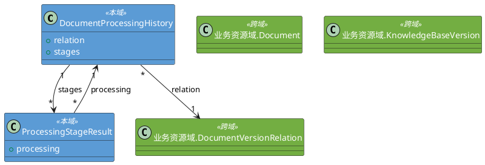
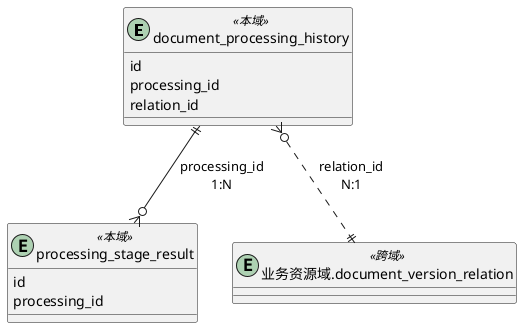

# 1. 领域类设计

## 1.1 类清单

| 类名 | 持久化(Y/N) | 备注 |
| :--- | :--- | :--- |
| build.domain.DocumentProcessingHistory | Y | 处理历史领域对象 |
| build.domain.ProcessingStageResult | Y | 阶段结果领域对象 |
| build.domain.ChunkResult | N | 分块结果数据类 |
| build.domain.ParseResult | N | 解析结果数据类 |

## 1.2 领域类详情

### 1.2.1 DocumentProcessingHistory

**字段映射**

| 字段名 | 存储映射 | 备注 |
| :--- | :--- | :--- |
| id | id | 领域对象标识 |
| processing_id | processing_id | 处理任务UUID |
| relation | relation_id | 关联 业务资源域.DocumentVersionRelation，通过外键关联（跨域引用） |
| attempt_no | attempt_no | 处理次数，从1递增 |
| status | status | 处理状态 |
| current_stage | current_stage | 当前阶段：check/parsed/cleaned/images_described/chunked/stored |
| progress | progress | 进度百分比(0-100) |
| started_at | started_at | 开始时间 |
| completed_at | completed_at | 完成时间 |
| error_message | error_message | 失败原因 |
| created_at | created_at | 记录时间 |
| stages | - | 关联 ProcessingStageResult 集合，反向查询所有阶段结果 |

**内部方法说明**

| 方法 | 入口 | 流程 |
| :--- | :--- | :--- |
| mark_succeeded() | DocumentProcessingHistory.mark_succeeded() | 设置 status=SUCCEEDED, progress=100, completed_at=now |
| mark_failed(error_message) | DocumentProcessingHistory.mark_failed() | 设置 status=FAILED, error_message, completed_at=now |
| update_progress(stage, progress) | DocumentProcessingHistory.update_progress() | 设置 current_stage, progress |

#### ProcessingStatus

| 页面文案 | 技术枚举 | 说明 |
| :--- | :--- | :--- |
| 待处理 | `PENDING` | 待处理 |
| 处理中 | `PROCESSING` | 处理中 |
| 成功 | `SUCCEEDED` | 处理成功 |
| 失败 | `FAILED` | 处理失败 |

### 1.2.2 ProcessingStageResult

**字段映射**

| 字段名 | 存储映射 | 备注 |
| :--- | :--- | :--- |
| id | id | 领域对象标识 |
| processing | processing_id | 关联 DocumentProcessingHistory，通过外键关联 |
| stage_name | stage_name | 阶段名 |
| status | status | 阶段状态（运行中/成功/失败） |
| duration_ms | duration_ms | 阶段耗时（毫秒） |
| result_path | result_path | MinIO 结果路径 |
| error_message | error_message | 失败原因 |
| created_at | created_at | 记录时间 |

#### StageStatus

| 页面文案 | 技术枚举 | 说明 |
| :--- | :--- | :--- |
| 运行中 | `RUNNING` | 阶段执行中 |
| 成功 | `SUCCEEDED` | 阶段完成 |
| 失败 | `FAILED` | 阶段失败 |

### 1.2.3 ChunkResult

| 字段名 | 类型 | 备注 |
| :--- | :--- | :--- |
| original_text | str | 原始文本 |
| processed_text | str | 处理后文本 |
| hypothetical_questions | List[str] | 假设性问题列表（HyDE） |
| relations | List[Tuple[str,str,str]] | 关系三元组 |
| page_range | Tuple[int,int] | 页码范围 |
| section_title | str | 所属章节标题 |

### 1.2.4 ParseResult

ParseResult 是解析层的标准输出数据结构，下游模块（清洗、分块、向量化）统一按此结构消费。

**字段映射**

| 字段名 | 类型 | 备注 |
| :--- | :--- | :--- |
| sections | List[ParsedSection] | 章节段落列表 |

**树状结构**

```json
{
  "sections": [
    {
      "title": "文档主标题",
      "content": [
        { "type": "text", "text": "纯文本段落" },
        { "type": "image", "data": "base64...", "format": "png", "caption": "..." },
        { "type": "table", "headers": ["..."], "rows": [["..."]] },
        { "type": "section", "section": {
          "title": "子章节标题",
          "content": [ ... ]
        }}
      ]
    }
  ]
}
```

Sections 为树状结构，每个 section 包含 `title` 和 `content` 数组。content 中所有元素（文本、图片、表格、子章节）统一按原文顺序排列。

**content 数组元素类型**

| type | 说明 | 关键字段 |
|------|------|---------|
| `text` | 纯文本段落 | `text` |
| `image` | 图片 | `data`(base64), `format`, `caption` |
| `table` | 表格 | `headers[]`, `rows[][]` |
| `section` | 子章节 | `section.title`, `section.content[]` |

**分阶段策略**

- 第一阶段 PDF 仅做纯文本提取，不推断标题层级；Word 可输出完整结构（标题层级、表格、图片）。
- 后续阶段再增强 PDF 的字体推断和 OCR。

**解析器选型**

| 格式 | 解析器 | 备注 |
|------|--------|------|
| PDF | pdfplumber | 可获取文本块精确坐标(x, y)，按段落间距聚类保留段落完整性，解决 PyPDF2 跨页截断问题 |
| Word | python-docx | 原生段落/表格/图片 API |

**兼容性约束**

任何解析器（包括未来可能引入的 markitdown）都必须将输出转为 ParseResult 树状结构。markitdown 输出为 Markdown 字符串，需增加反向解析层：识别 `#` 标题映射为 ParsedSection，识别 `|` 表格映射为 ParsedTable，识别图片映射为 ParsedImage。

## 1.3 类图



# 2. 数据结构

## 2.1 表设计

### 2.1.1 表清单

| 表名 | 表中文名 | 备注 |
| :--- | :--- | :--- |
| document_processing_history | 文档处理历史记录表 | 记录每次文档处理的详细历史 |
| processing_stage_result | 处理阶段结果表 | 记录各处理阶段的中间结果元信息 |

### 2.1.2 document_processing_history 表

**表设计**

| 列名 | 类型 | 非空性(Y/N) | 备注 |
| :--- | :--- | :--- | :--- |
| id | BigInteger | N | 主键，自增 |
| processing_id | String(36) | N | 处理任务UUID |
| relation_id | BigInteger | N | 关联 业务资源域.document_version_relation.id（跨域引用） |
| attempt_no | Integer | N | 处理次数，从1递增 |
| status | String(20) | N | 待处理/处理中/成功/失败。存储映射：PENDING→"pending", PROCESSING→"processing", SUCCEEDED→"succeeded", FAILED→"failed" |
| current_stage | String(50) | Y | 当前阶段：check/parsed/cleaned/images_described/chunked/stored |
| progress | Integer | N | 进度百分比(0-100) |
| started_at | TIMESTAMP | N | 开始时间 |
| completed_at | TIMESTAMP | Y | 完成时间 |
| error_message | Text | Y | 失败原因 |
| created_at | TIMESTAMP | N | 记录时间 |

**表约束**

| 约束名 | 类型 | 字段 | 说明 |
| :--- | :--- | :--- | :--- |
| pk_document_processing_history | PK | id | 主键 |
| fk_history_relation_id_ref_doc_ver_relation | FK | relation_id → document_version_relation.id | 关联文档-版本关联 |
| check_processing_status | CHECK | status | 限制 status 为 pending/processing/succeeded/failed |
| check_progress_range | CHECK | progress | 限制 progress 在 0-100 之间 |
| uk_history_relation_attempt_no | UNIQUE | relation_id, attempt_no | 同一关联记录处理次数唯一 |
| uk_history_processing_id | UNIQUE | processing_id | 处理任务ID全局唯一 |
| idx_processing_history_relation_id | INDEX | relation_id | 按关联记录查询处理历史 |
| idx_processing_history_processing_id | INDEX | processing_id | 按处理任务ID查询 |

### 2.1.3 processing_stage_result 表

**表设计**

| 列名 | 类型 | 非空性(Y/N) | 备注 |
| :--- | :--- | :--- | :--- |
| id | BigInteger | N | 主键，自增 |
| processing_id | String(36) | N | 关联 document_processing_history.processing_id |
| stage_name | String(50) | N | 阶段名：check/parsed/cleaned/images_described/chunked/stored |
| status | String(20) | N | 运行中/成功/失败。存储映射：RUNNING→"running", SUCCEEDED→"succeeded", FAILED→"failed" |
| duration_ms | Integer | N | 阶段耗时（毫秒） |
| result_path | String(500) | Y | MinIO 路径（processing-results/{processing_id}/{stage}.json） |
| error_message | Text | Y | 失败原因 |
| created_at | TIMESTAMP | N | 记录时间 |

**表约束**

| 约束名 | 类型 | 字段 | 说明 |
| :--- | :--- | :--- | :--- |
| pk_processing_stage_result | PK | id | 主键 |
| fk_stage_processing_id_ref_history | FK | processing_id → document_processing_history.processing_id | 关联处理记录 |
| idx_stage_processing_id | INDEX | processing_id | 按处理任务ID查询阶段结果 |

### 2.1.4 ER图



# 3. 事件设计

## 3.1 事件清单

| 事件名 | 主题 | 处理模式 | 说明 |
| :--- | :--- | :--- | :--- |
| `Processing_Stage_Completed_Event` | `build.stage_event` | 广播 | 文档处理流水线阶段事件 |

## 3.2 Processing_Stage_Completed_Event

### 3.2.1 事件接口

生产者 API，处理流水线各阶段完成后调用对应方法。各方法内部创建 StageCompletedEvent 消息体，委托 ProcessingEventBus 分发。

**内部方法说明**

| 方法 | 入口 | 流程 |
| :--- | :--- | :--- |
| stage_completed(processing_id, stage_name, duration_ms) | ProcessingStageCompletedEvent.stage_completed() | 创建 StageCompletedEvent(status="succeeded")，调用 ProcessingEventBus.publish() |
| stage_failed(processing_id, stage_name, duration_ms, error_message) | ProcessingStageCompletedEvent.stage_failed() | 创建 StageCompletedEvent(status="failed")，调用 ProcessingEventBus.publish() |

**ProcessingEventBus**

事件分发实现，供事件接口各方法内部调用。

| 方法 | 入口 | 流程 |
| :--- | :--- | :--- |
| publish(event) | ProcessingEventBus.publish() | 将 StageCompletedEvent 放入 asyncio.Queue |
| subscribe() | ProcessingEventBus.subscribe() | 注册监听器，返回生成器消费事件 |

### 3.2.2 事件消息体

**StageCompletedEvent**

| 字段名 | 类型 | 备注 |
| :--- | :--- | :--- |
| processing_id | str | 处理任务ID |
| stage_name | str | 阶段名 |
| status | str | 阶段状态，可选值：<br>- 运行中<br>- 成功<br>- 失败 |
| duration_ms | int | 阶段耗时（毫秒） |

### 3.2.3 事件消费者

#### ProcessingMonitor

处理进度监视器，实例数：N（每个监控页面一个实例）。

通过 ProcessingEventBus.subscribe() 订阅事件，将阶段事件通过 SSE 推送给对应前端页面。

**内部方法说明**

| 方法 | 入口 | 流程 |
| :--- | :--- | :--- |
| on_event(event) | ProcessingMonitor.on_event() | 接收 StageCompletedEvent，过滤当前监控的 processing_id，序列化为 JSON 通过 SSE 推送给前端 |
| close() | ProcessingMonitor.close() | 页面关闭 SSE 连接时调用，取消订阅并释放实例 |

# 4. 后端功能设计

## 4.1 模块前缀

| 模块 | 入口路径 |
| :--- | :--- |
| 构建域 | build.api |

## 4.2 异常枚举

**枚举类名**: `BuildErrorCode`（Python 枚举成员名遵循 PEP 8，使用全大写）

| 枚举名 | 状态码 | 描述 |
| :--- | :--- | :--- |
| `DOCUMENT_NOT_FOUND` | 404001 | 文档不存在 |
| `RELATION_NOT_FOUND` | 404003 | 文档-版本关联不存在 |
| `PROCESSING_IN_PROGRESS` | 001003 | 文档正在处理中，请稍后再试（警告码） |
| `PARSING_FAILED` | 500003 | 文档解析失败 |
| `CHUNKING_FAILED` | 500004 | 文档分块失败 |
| `STORAGE_UNAVAILABLE` | 503001 | MinIO存储服务不可用 |
| `DATABASE_UNAVAILABLE` | 503002 | 数据库服务不可用 |
| `LLM_UNAVAILABLE` | 503003 | LLM服务不可用 |
| `SERVICE_UNAVAILABLE` | 503004 | 事件总线不可用 |

## 4.3 API清单

| 方法 | URL | 代码入口 | 名称 | 对应REQ章节 |
| :--- | :--- | :--- | :--- | :--- |
| GET | /build/history/list | query_history | 处理记录查询 | REQ #4 |
| GET | /build/stage/{processing_id}/{stage_name} | stage_result | 阶段结果详情 | REQ #5 |
| GET | /build/detail | view | 处理详情视图 | REQ #5 |
| GET | /build/stream/{processing_id} | stream | 处理进度 SSE 流 | REQ #6.2 |

## 4.4 文档处理

由业务资源域（文档上传完成、工具栏"处理"按钮、版本构建）调用触发的内部函数。接收文档ID和关联记录ID，执行完整处理流水线。

### 4.4.1 处理流程

1) 校验 document_id 和 relation_id 不为空
2) 查询 document_version_relation 表中该 relation_id 是否存在 status='processing' 的记录，存在则抛出 `PROCESSING_IN_PROGRESS`
3) 查询当前最大的 attempt_no，计算新值为 max+1
4) 生成 processing_id（UUID）
5) 后台异步启动文档处理任务（传递 document_id、relation_id、processing_id、attempt_no），触发失败记录 ERROR 日志
6) 抛出异常：数据库不可访问时抛出 `DATABASE_UNAVAILABLE`

### 4.4.2 运行配置

#### 模型配置

| 配置项 | 类型 | 默认值 | 说明 |
| :--- | :--- | :--- | :--- |
| `chunking_enabled` | boolean | `false` | 分块模型开关，`true` 时使用以下五元组，`false` 时回退默认模型 |
| `chunking_model` | str | — | 模型名称 |
| `chunking_model_provider` | str | — | 模型供应商 |
| `chunking_api_key` | str | — | API 密钥 |
| `chunking_api_base` | str | — | API 地址（可选，自定义/私有部署时填写） |
| `chunking_temperature` | float | — | 温度参数 |
| `image_describer_enabled` | boolean | `false` | 图片描述模型开关，`true` 时使用以下五元组，`false` 时回退默认模型 |
| `image_describer_model` | str | — | 视觉模型名称 |
| `image_describer_model_provider` | str | — | 模型供应商 |
| `image_describer_api_key` | str | — | API 密钥 |
| `image_describer_api_base` | str | — | API 地址（可选，自定义/私有部署时填写） |
| `image_describer_temperature` | float | — | 温度参数 |

#### 分块参数

| 功能 | 说明 |
| :--- | :--- |
| 最大分块字符数 | `chunk_max_chars`，默认 `800`，整数 |
| 最小分块字符数 | `chunk_min_chars`，默认 `0.5`；`(0,1)` 内为 max_chars 比例，`>1` 为绝对值 |
| 窗口重叠量 | `chunk_overlap`，默认 `0.1`；`(0,1)` 内为 max_chars 比例，`>1` 为绝对值 |
| 窗口大小 | `chunk_window`，默认 `1.5`；`(1,5)` 内为 max_chars 比例，`>5` 为绝对值 |

### 4.4.3 文档检查

**输入**：document_id, relation_id, processing_id, attempt_no

**处理流程**

1) 通过 document_id 查询业务资源域 document 记录，不存在则 INSERT document_processing_history（relation_id, status='failed'），写入 error_message='文档不存在'，终止处理
2) 从 document 记录中读取 file_hash，检查 MinIO 文档桶中是否存在对应文件，不存在则 INSERT document_processing_history（relation_id, status='failed'），写入 error_message='文档文件不存在'，终止处理
3) 尝试从 MinIO 读取文件头部验证可读性（stat_object + 文件大小 > 0），不可读则 INSERT document_processing_history（relation_id, status='failed'），写入 error_message='文档文件不可读'，终止处理
4) INSERT document_processing_history 记录（relation_id, processing_id, attempt_no, status='processing', current_stage='check', progress=10, started_at=now）
5) INSERT processing_stage_result（stage='check', status='running'）
6) 记录阶段完成：UPDATE processing_stage_result（status='succeeded', duration_ms），发布 Processing_Stage_Completed_Event
7) 抛出异常：MinIO 不可访问时抛出 `STORAGE_UNAVAILABLE`，数据库不可访问时抛出 `DATABASE_UNAVAILABLE`

**中间结果**：无（验证通过后进入下一阶段）

### 4.4.4 文档解析

**输入**：file_hash（从 MinIO 获取文件）

**处理流程**

1) INSERT processing_stage_result（stage='parsed', status='running'）
2) 从 MinIO 下载完整文件，下载失败则 UPDATE processing_stage_result（status='failed', error_message），终止处理
3) 根据文件 MIME 类型路由到对应解析器：
   - PDF：使用 pdfplumber 提取纯文本、图片元数据、表格结构（pdfplumber 可获取文本块精确坐标，按段落间距聚类，解决 PyPDF2 的跨页段落断裂问题）
   - Word：使用 python-docx 提取文本、图片、表格
4) 输出 ParseResult：包含 ParsedSection（章节段落）、ParsedText（纯文本）、ParsedImage（图片元数据）、ParsedTable（表格数据）
5) 解析失败则 UPDATE processing_stage_result（status='failed', error_message），记录 ERROR 日志，抛出 `PARSING_FAILED`
6) 记录阶段完成：UPDATE processing_stage_result（status='succeeded', duration_ms），发布 Processing_Stage_Completed_Event
7) 更新处理进度 progress=30，current_stage='parsed'

**中间结果**：`ParseResult`，写入 MinIO `processing-results/{processing_id}/parsed.json`

### 4.4.5 文档清洗

**输入**：ParseResult（上一阶段输出）

**处理流程**

1) INSERT processing_stage_result（stage='cleaned', status='running'）
2) 执行 Phase1 基础清洗：
   - 去除多余空行、空格
   - 修复跨页段落断裂
   - 统一标题格式
3) 执行 Phase2 PDF 特有清洗：
   - 去除页眉、页脚、页码
   - 去除水印文本
4) 处理封面、封底、目录：
   - 识别并移除封面封底重复内容
   - 将目录页转换为章节索引结构
5) 输出清洗后的 ParseResult，元素类型包含：text、image、table、heading
6) 记录阶段完成：UPDATE processing_stage_result（status='succeeded', duration_ms），发布 Processing_Stage_Completed_Event
7) 更新处理进度 progress=50，current_stage='cleaned'

**中间结果**：清洗后的 `ParseResult`，写入 MinIO `processing-results/{processing_id}/cleaned.json`

### 4.4.6 图片描述生成

**输入**：ParseResult（包含 ParsedImage 元素）

**处理流程**

1) INSERT processing_stage_result（stage='images_described', status='running'）
2) 遍历 ParseResult 中的 ParsedImage 元素
3) 从 MinIO 读取图片文件，使用视觉模型生成描述文字
4) 用 `[IMAGE_START:caption] 描述文字 [IMAGE_END]` 替换原图片位置，保留原始 ParsedImage 信息
5) 记录阶段完成：UPDATE processing_stage_result（status='succeeded', duration_ms），发布 Processing_Stage_Completed_Event
6) 更新处理进度 progress=60，current_stage='images_described'

**中间结果**：包含图片描述的 ParseResult（无独立写入，合并到下一阶段）

### 4.4.7 文档分块

**输入**：ParseResult（清洗后含图片描述）

**处理流程**

1) INSERT processing_stage_result（stage='chunked', status='running'）
2) 按三级标题（H1/H2/H3）将文本划分为独立分块单位，H4 及以下不作为单独分块单位，多个可合并到同一分块
3) 判断 section 文本是否 ≤ max_chars：
   - 是：直接作为一个 chunk
   - 否：进入窗口滑动
4) 执行窗口滑动：
   - 窗口大小 = max_chars
   - 滑动步长 = max_chars * overlap_ratio
5) 对每个窗口调用 LLM Pipeline（一次调用，4步流水线）：
   - 语义分割
   - 指代消解
   - 假设性问题生成（HyDE）
   - 关系三元组抽取
6) 映射 LLM 返回到 ChunkResult：`questions` → `hypothetical_questions`，`triplets` → `relations`
7) 分块后还原：
   - 还原 H4 及以下标题到所属 chunk
   - 合并过短的分块（< min_chars）
8) 输出 ChunkResult 列表，每个包含 original_text、processed_text、hypothetical_questions、relations、page_range、section_title
9) 分块失败则 UPDATE processing_stage_result（status='failed', error_message），记录 ERROR 日志，抛出 `CHUNKING_FAILED`
10) 记录阶段完成：UPDATE processing_stage_result（status='succeeded', duration_ms），发布 Processing_Stage_Completed_Event
11) 更新处理进度 progress=80，current_stage='chunked'

**中间结果**：`List[ChunkResult]`，写入 MinIO `processing-results/{processing_id}/chunked.json`

### 4.4.8 数据入库

**输入**：List[ChunkResult]

**字段写入策略**

| 字段名 | 类型 | 写入数据库 | 备注 |
| :--- | :--- | :--- | :--- |
| original_text | str | — | 原始文本，调测用 |
| processed_text | str | Elasticsearch、Milvus | 处理后文本 |
| hypothetical_questions | List[str] | Milvus | 假设性问题列表（HyDE） |
| relations | List[Tuple[str,str,str]] | Neo4j | 关系三元组 |
| page_range | Tuple[int,int] | — | 页码范围 |
| section_title | str | — | 所属章节标题 |
| enabled | Boolean | PostgreSQL、ES、Milvus、Neo4j | 继承文档启用状态，控制检索过滤 |

以上所有字段均写入 PostgreSQL。ES、Milvus、Neo4j 仅标注其额外索引的字段。

#### Elasticsearch 索引结构

| 字段 | 类型 | 来源 | 说明 |
| :--- | :--- | :--- | :--- |
| chunk_id | VARCHAR | DB chunk.id | 关联 PostgreSQL |
| document_id | VARCHAR | 上下文 | 按文档清理 |
| keyword | text | ChunkResult.processed_text | 全文检索 |
| enabled | boolean | document.status | 过滤条件 |

#### Milvus 向量结构

| 字段 | 类型 | 来源 | 说明 |
| :--- | :--- | :--- | :--- |
| chunk_id | VARCHAR | DB chunk.id | 主键，关联 PostgreSQL |
| document_id | VARCHAR | 上下文 | 按文档清理 |
| vector | FloatVector | embedding(processed_text + "\n" + hypothetical_questions.join("\n")) | 语义检索 |
| enabled | Boolean | document.status | 过滤条件 |

#### Neo4j 图谱结构

| 元素 | 属性 | 说明 |
| :--- | :--- | :--- |
| Document 节点 | `document_id` | 文档节点 |
| Entity 节点 | `name` | 实体名称，跨文档共享 |
| CONTAINS 关系 | `enabled` | Document → Entity |
| {predicate} 关系 | `document_id`, `chunk_id`, `enabled` | Entity → Entity |

**处理流程**

1) INSERT processing_stage_result（stage='stored', status='running'）
2) UPDATE 业务资源域.document_version_relation 设置 stored=false（标记数据暂不可检索）
3) 清理已有数据：
   - DELETE 业务资源域.document_chunk WHERE document_id = ?
   - DELETE ES 索引 WHERE document_id = ?
   - DELETE Milvus 向量 WHERE document_id = ?
   - Neo4j 删除：
     a) MATCH (d:Document {document_id})-[:CONTAINS]->(:Entity) DELETE CONTAINS
     b) MATCH ()-[r]->() WHERE r.document_id = ? DELETE r
     c) MATCH (d:Document {document_id}) DELETE d
     d) MATCH (e:Entity) WHERE NOT (e)<-[:CONTAINS]-() DELETE e
4) 开启 PostgreSQL 事务：
   - INSERT 业务资源域.document_chunk（批量，遍历 ChunkResult 映射字段，enabled 继承文档当前启用状态）
   - UPDATE 业务资源域.document 设置 chunk_count, total_token=sum(chunk.processed_text_token_count + chunk.hypothetical_questions_token_count), processed_at
   - UPDATE document_processing_history 设置 status='succeeded', progress=100, completed_at
   - UPDATE 业务资源域.document_version_relation 设置 stored=true（标记数据可检索）
   - UPDATE processing_stage_result 设置 status='succeeded', duration_ms
   - COMMIT，提交失败则回滚（stored 保持 false），更新处理历史状态为 'failed'，记录 ERROR 日志
5) ES 索引写入：对每个 chunk，bulk index {chunk_id, document_id, processed_text, enabled}
6) Milvus 向量写入：对每个 chunk，拼接文本 → embedding → insert {chunk_id, document_id, vector, enabled}
7) Neo4j 图谱写入：对每个三元组：
   - MERGE (d:Document {document_id})
   - MERGE (s:Entity {name: subject})
   - MERGE (o:Entity {name: object})
   - MERGE (d)-[:CONTAINS {enabled}]->(s)
   - MERGE (d)-[:CONTAINS {enabled}]->(o)
   - MERGE (s)-[:{predicate} {document_id, chunk_id, enabled}]->(o)
8) 步骤 5/6/7 任一步失败：UPDATE processing_history（status='failed', error_message），记录 ERROR 日志。残留数据不立即清理，下次处理同一文档时由步骤 3 统一清理。
9) 发布 Processing_Stage_Completed_Event（stage='stored', status='succeeded'）

**中间结果**：无（流水线终点）

## 4.5 处理记录查询

### 4.5.1 请求模型

| 字段 | 类型 | 必填 | 说明 |
| :--- | :--- | :--- | :--- |
| page | Integer | M | 页码，默认1 |
| page_size | Integer | M | 每页数量，默认20 |
| relation_id | BigInteger | M | 关联记录ID |

### 4.5.2 响应模型

```json
{
  "code": "000000",
  "description": "成功",
  "content": {
    "data": [
      {
        "id": 1,
        "processing_id": "xxx-xxx",
        "attempt_no": 2,
        "status": "成功",
        "current_stage": "chunked",
        "progress": 80,
        "started_at": "2026-04-22T10:30:00+08:00",
        "completed_at": null,
        "error_message": null
      }
    ],
    "total": 5,
    "page": 1,
    "page_size": 20,
    "total_pages": 1
  }
}
```

### 4.5.3 处理流程

1) 接收分页参数和 relation_id
2) 查询 document_processing_history 表，按 relation_id 过滤
3) 按 attempt_no 降序排序，返回分页结果
4) 抛出异常：数据库不可访问时抛出 `DATABASE_UNAVAILABLE`，记录 ERROR 日志

## 4.6 阶段结果详情

### 4.7.1 请求模型

路径参数：processing_id, stage_name

### 4.7.2 响应模型

```json
{
  "code": "000000",
  "description": "成功",
  "content": {
    "stage_name": "chunked",
    "status": "succeeded",
    "duration_ms": 5000,
    "result": { ... }
  }
}
```

### 4.7.3 处理流程

1) 通过 processing_id 和 stage_name 查询 processing_stage_result 记录，不存在则抛出 `DOCUMENT_NOT_FOUND`
2) 校验阶段 status 为 'succeeded'，非 succeeded 则抛出 `PARSING_FAILED`（表示该阶段未完成或失败）
3) 从 result_path 读取 MinIO 中的 JSON 文件，读取失败则抛出 `STORAGE_UNAVAILABLE`
4) 返回 JSON 格式的中间结果内容
5) 抛出异常：MinIO 不可访问时抛出 `STORAGE_UNAVAILABLE`，数据库不可访问时抛出 `DATABASE_UNAVAILABLE`，均记录 ERROR 日志

## 4.7 处理详情视图

### 4.7.1 请求模型

查询参数：

| 字段 | 类型 | 必填 | 说明 |
| :--- | :--- | :--- | :--- |
| relation_ids | String | O | 关联记录ID，逗号分隔传多个（来自关联查询多选） |
| processing_id | String | O | 处理任务ID（来自处理记录查询单条） |

relation_ids 与 processing_id 二选一。

### 4.7.2 响应模型

```json
{
  "code": "000000",
  "description": "成功",
  "content": {
    "tabs": [
      {
        "relation_id": 1,
        "document_id": 1,
        "document_name": "report.pdf",
        "processing_id": "xxx-xxx",
        "attempt_no": 2,
        "status": "processing",
        "current_stage": "chunked",
        "progress": 80,
        "started_at": "2024-01-01T00:00:00Z",
        "stages": [
          { "name": "check", "status": "succeeded", "duration_ms": 500 },
          { "name": "parsed", "status": "succeeded", "duration_ms": 3000 },
          { "name": "cleaned", "status": "succeeded", "duration_ms": 2000 },
          { "name": "images_described", "status": "succeeded", "duration_ms": 8000 },
          { "name": "chunked", "status": "running", "duration_ms": null },
          { "name": "store", "status": "pending", "duration_ms": null }
        ],
        "error_message": null
      }
    ]
  }
}
```

### 4.7.3 处理流程

1) 接收 relation_ids（可多个）或 processing_id
2) 若传 processing_id，查询对应的 relation_id 后转为 relation_ids 处理
3) 遍历每个 relation_id，查询最新的 processing_history（含 status、current_stage、progress、error_message）
4) 查询 processing_stage_result 表中各阶段记录（stage_name、status、duration_ms），按 created_at 升序
5) 返回多 tab 视图数据，每个 tab 对应一个关联记录的处理过程（进度详情 + 阶段状态）
6) 抛出异常：数据库不可访问时抛出 `DATABASE_UNAVAILABLE`，记录 ERROR 日志

## 4.8 处理进度 SSE 流

**前置条件**：前端先调 #15 获取 `status`，仅当 status 为 `processing` 或 `pending` 时发起 #16 连接。已 `succeeded` 或 `failed` 时不发起。

### 4.8.1 请求模型

路径参数：processing_id

### 4.8.2 响应模型

SSE 文本流（text/event-stream），每条消息为 JSON：

```json
{
  "processing_id": "xxx-xxx",
  "stage_name": "parsed",
  "status": "succeeded",
  "duration_ms": 1500
}
```

终态条件：status 为 "failed" 或 stage_name 为 "stored" 时关闭流。

### 4.8.3 处理流程

1) 接收 processing_id
2) 通过 ProcessingEventBus 订阅该 processing_id 的事件队列
3) 收到事件后转换为 SSE 格式推送给客户端
4) 客户端断开连接或到达终态时关闭流
5) 抛出异常：事件总线不可用时抛出 `SERVICE_UNAVAILABLE`，记录 ERROR 日志

# 5. 跨模块约束

- 处理流水线执行前校验业务资源域数据完整性（文档存在、文件可读）
- 数据入库时 enabled 字段值继承业务资源域当前文档的启用状态
- 处理流水线由业务资源域调用触发（文档上传完成、工具栏"处理"按钮、版本构建）
- document_processing_history.relation_id 关联业务资源域 document_version_relation.id
