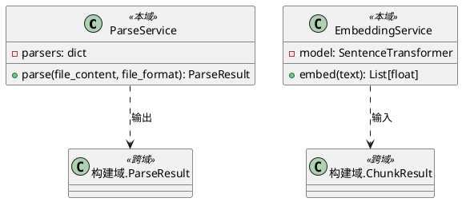

# 领域类设计

## 领域类清单

| 类名 | 持久化(Y/N) | 备注 |
| :--- | :--- | :--- |
| model.domain.ParseService | N | 文档解析服务，封装 pdfplumber / python-docx |
| model.domain.EmbeddingService | N | 向量化服务，封装 sentence-transformers |

## ParseService 类

**字段设计**

| 字段名 | 类型 | 存储映射 | 备注 |
| :--- | :--- | :--- | :--- |
| parsers | dict | — | 解析器注册表，key 为 MIME 类型，value 为解析器实例 |

**内部方法说明**

| 方法 | 入口 | 流程 |
| :--- | :--- | :--- |
| parse(file_content, file_format) | ParseService.parse() | 根据 file_format 路由到对应解析器（pdfplumber / python-docx），调用解析器提取文本、表格、图片，组装并返回 ParseResult |
| _init_parsers() | ParseService._init_parsers() | 懒初始化 pdfplumber 和 python-docx 实例，注册到 parsers 字典 |

## EmbeddingService 类

**字段设计**

| 字段名 | 类型 | 存储映射 | 备注 |
| :--- | :--- | :--- | :--- |
| model | SentenceTransformer | — | sentence-transformers 模型实例，首次请求时懒加载 |
| embedding_dimension | int | — | 嵌入向量维度，模型加载后填充 |

**内部方法说明**

| 方法 | 入口 | 流程 |
| :--- | :--- | :--- |
| embed(text) | EmbeddingService.embed() | 首次调用触发 _load_model() 懒加载模型，调用 model.encode() 生成向量，返回浮点数组 |
| _load_model() | EmbeddingService._load_model() | 根据配置加载 sentence-transformers 模型到内存，填充 embedding_dimension |

## 类图

# 数据结构

无

# 事件设计

无

# 后端功能设计

## 模块前缀

| 模块 | 入口路径 |
| :--- | :--- |
| 模型域 | model.api |

## 异常枚举

**枚举类名**: `ModelErrorCode`

| 枚举名 | 状态码 | 描述 |
| :--- | :--- | :--- |
| `MODEL_LOAD_FAILED` | 503005 | 模型加载失败 |
| `INFERENCE_FAILED` | 500006 | 模型推理失败 |
| `UNSUPPORTED_FORMAT` | 400002 | 不支持的文档格式 |
| `INVALID_INPUT` | 400003 | 无效的模型输入 |

## API清单

| 方法 | URL | 代码入口 | 名称 | 对应REQ章节 |
| :--- | :--- | :--- | :--- | :--- |
| POST | /model/parsing | model.api.parse | 文档解析 | REQ 文档解析 |
| POST | /model/embedding | model.api.embed | 向量化 | REQ 向量化 |

## 文档解析

**请求模型**: `schemas.model.ParseRequest`

| 字段 | 类型 | 必填 | 校验规则 |
| :--- | :--- | :--- | :--- |
| file_content | bytes | M | 非空，最大 100MB |
| file_format | str | M | 可选值：pdf、docx、doc |
| file_name | str | M | 非空，用于日志追踪 |

**响应模型**: `schemas.model.ParseResponse`

| 字段 | 类型 | 说明 |
| :--- | :--- | :--- |
| sections | List[ParsedSection] | 章节段落列表，树状结构 |

**处理流程**

1) 接收 file_content、file_format、file_name
2) 校验 file_format 是否为 pdf / docx / doc，不支持则抛出 `UNSUPPORTED_FORMAT`
3) 校验 file_content 非空，内容不可读则抛出 `INVALID_INPUT`
4) 根据 file_format 路由解析器：pdf → pdfplumber，docx/doc → python-docx
5) 调用解析器提取文本、表格、图片，组装 ParseResult
6) 解析器抛出异常则抛出 `INFERENCE_FAILED`，记录 ERROR 日志
7) 返回 ParseResponse（sections 列表）

**中间结果**: 无（无状态，请求响应模式）

## 向量化

**请求模型**: `schemas.model.EmbeddingRequest`

| 字段 | 类型 | 必填 | 校验规则 |
| :--- | :--- | :--- | :--- |
| text | str | M | 非空 |

**响应模型**: `schemas.model.EmbeddingResponse`

| 字段 | 类型 | 说明 |
| :--- | :--- | :--- |
| vector | List[float] | 嵌入向量 |
| dimension | int | 向量维度 |

**处理流程**

1) 接收 text
2) 校验 text 非空，为空则抛出 `INVALID_INPUT`
3) 模型未加载则触发懒加载：调用 sentence-transformers 加载配置的模型到内存。加载失败抛出 `MODEL_LOAD_FAILED`，记录 ERROR 日志
4) 调用 model.encode(text) 生成向量
5) 推理失败抛出 `INFERENCE_FAILED`，记录 ERROR 日志
6) 返回 EmbeddingResponse（vector, dimension）

**中间结果**: 无（无状态，请求响应模式）

# 跨模块约束

- 模型域端点由 Higress AI 网关路由，不直接对外暴露
- ParseResponse 的 sections 结构与构建域 DEG §1.2.4 ParseResult 保持一致
- 嵌入向量的维度由加载的模型决定，调用方（构建域）通过响应中的 dimension 字段获取
