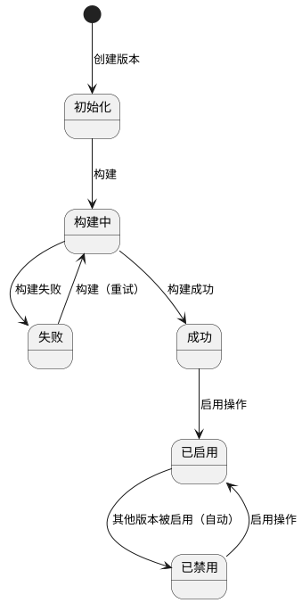

# 1. 知识库版本状态迁移

## 1.1 版本状态图

# 2. 界面流转

# 3. 版本管理

## 3.1 功能描述

分页查询知识库版本列表，支持按状态过滤，按版本名称降序排列。

## 3.2 界面元素

**表 1 界面元素基本信息**

| 属性 | 值 |
| :--- | :--- |
| 界面名称 | 版本管理 |
| 界面类型 | 数据查询 |
| 展现方式 | 页面 |

**表 2 版本管理的搜索栏**

| 字段名 | 输入方式 | 查询方式(P/EP/BP/AP) | 备注 |
| :--- | :--- | :--- | :--- |
| 状态 | singleSelect | P | 可选值： - 初始化 - 构建中 - 成功 - 已启用 - 已禁用 - 失败 默认值：全部 |

**表 3 版本管理的工具栏**

| 字段名 | 批量/单条(B/S/N) | 类型(P/PP/SR/SNR/C/V) | 功能 | 备注 |
| :--- | :--- | :--- | :--- | :--- |
| 新建 | N | SR | 创建版本记录（状态=初始化） | 始终可用 |
| 构建 | S | SR | 触发异步构建 | 仅选中 初始化 或 失败 版本时可用，未选中或选中超过一条时置灰 |
| 启用 | S | SR | 启用选中的版本 | 仅选中 成功 或 已禁用 版本时可用，未选中或选中超过一条时置灰 |
| 文档查看 | S | P | 打开文档-版本关联查询弹出框 | 未选中或选中超过一条记录时置灰，悬停提示"请选择一条记录" |

**表 4 版本管理的查询结果展现**
- 排序规则: 版本名称 降序

| 字段名 | 最大长度 | 选中栏展示(Y/N) | 备注 |
| :--- | :--- | :--- | :--- |
| 选择框 | - | N | 单选 radio |
| 版本名称 | - | Y | 格式 v20260422_103000 |
| 状态 | - | N | 初始化 / 构建中 / 成功 / 已启用 / 已禁用 / 失败 |
| 文档数 | - | N | 该版本包含的文档数量 |
| 分块数 | - | N | 该版本包含的 chunk 总数 |
| 操作人 | 15 | N | 超长截断，hover 显示全文 |
| 开始时间 | - | N | YYYY-MM-DD HH:mm:ss 格式 |
| 完成时间 | - | N | 未完成时显示"-" |
| 创建时间 | - | N | YYYY-MM-DD HH:mm:ss 格式 |

## 3.3 特殊需求

无

# 4. 版本新建

## 4.1 功能描述

创建新版本记录，状态初始化为 初始化。

## 4.2 前置条件

无

## 4.3 处理流程

1) 前端弹出确认框，用户确认后提交请求
2) 后台生成版本名称（v + 时间戳），创建版本记录（状态=初始化）
3) 后台返回版本名称和状态

## 4.4 异常提示

**表 5 异常提示**

| 判断条件 | 提示信息 |
| :--- | :--- |
| 数据库不可访问 | 数据库服务不可用 |

## 4.5 特殊需求

无

# 5. 版本构建

## 5.1 功能描述

手动触发知识库构建，系统遍历当前所有已启用文档执行完整处理流水线。构建期间阻塞文档的上传/启用/停用/处理操作。

## 5.2 前置条件

- 目标版本存在
- 目标版本状态为 初始化 或 失败
- 不存在 构建中 状态的版本

## 5.3 处理流程

1) 前端弹出确认框，用户确认后提交请求
2) 后台查询目标版本，不存在则返回错误
3) 后台校验目标版本状态为 初始化 或 失败，不满足则返回错误
4) 后台检查是否存在 构建中 状态的版本，存在则拒绝
5) 后台将目标版本状态改为 构建中
6) 后台异步触发构建任务，遍历所有启用文档执行处理流水线，全部完成后更新状态=成功，失败则更新状态=失败
7) 后台返回版本名称和状态

## 5.4 异常提示

**表 6 异常提示**

| 判断条件 | 提示信息 |
| :--- | :--- |
| 版本不存在 | 版本不存在 |
| 版本状态不是 初始化 或 失败 | 该版本无法构建，仅可构建 初始化 或 失败 状态的版本 |
| 版本已是 构建中 状态 | 该版本正在构建中，请等待完成后再操作 |
| 存在 构建中 状态的版本 | 已有版本正在构建中，请等待完成后再操作 |

## 5.5 特殊需求

无

# 6. 版本启用

## 6.1 功能描述

启用指定版本，系统自动将当前启用版本改为 已禁用，将目标版本改为 已启用。

## 6.2 前置条件

- 目标版本存在
- 目标版本状态为 成功 或 已禁用
- 目标版本不是当前已启用的版本

## 6.3 处理流程

1) 前端弹出确认框，展示选中版本信息，用户确认后提交请求
2) 后台查询目标版本，不存在则返回错误
3) 后台校验目标版本状态为 成功 或 已禁用，不满足则返回错误
4) 后台查询当前启用版本，若存在则将其状态改为 已禁用
5) 后台将目标版本状态改为 已启用
6) 后台返回启用结果（含被替换的原版本名称）

## 6.4 异常提示

**表 7 异常提示**

| 判断条件 | 提示信息 |
| :--- | :--- |
| 版本不存在 | 版本不存在 |
| 版本状态不是 成功 或 已禁用 | 该版本无法启用，仅可启用 成功 或 已禁用 状态的版本 |
| 版本已是启用状态 | 该版本已是启用状态，无需重复操作 |

## 6.5 特殊需求

无

# 7. 其他需求

## 7.1 文档管理

文档处理（1.3）在处理开始时检查是否存在启用的知识库版本，若无则自动执行创建→启用流程，将文档关联到新启用的版本。

# 8. 跨模块约束

无

# 9. 参考文档

[1] docs/OVERVIEW.md — 系统功能总览
[2] docs/ARCHITECTURE.md — 系统技术架构
