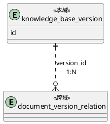

# 1. 领域类设计

## 1.1 类清单

| 类名 | 持久化(Y/N) | 备注 |
| :--- | :--- | :--- |
| admin.version.domain.KnowledgeBaseVersion | Y | 知识库版本领域对象 |

## 1.2 领域类详情

### 1.2.1 KnowledgeBaseVersion

**字段映射**

| 字段名 | 存储映射 | 备注 |
| :--- | :--- | :--- |
| id | id | 领域对象标识 |
| version_name | version_name | 版本名称（v20260422_103000） |
| status | status | 版本状态（初始化/构建中/成功/已启用/已禁用/失败） |
| document_count | document_count | 该版本包含的文档数量 |
| chunk_count | chunk_count | 该版本包含的 chunk 总数 |
| error_message | error_message | 失败原因 |
| created_by | created_by | 操作人 |
| started_at | started_at | 开始时间 |
| completed_at | completed_at | 完成时间 |
| created_at | created_at | 创建时间 |
| updated_at | updated_at | 更新时间 |

**内部方法说明**

| 方法 | 入口 | 流程 |
| :--- | :--- | :--- |
| start_build() | KnowledgeBaseVersion.start_build() | 校验 status 为 INIT 或 FAILED，设置 status=BUILDING，更新 started_at |
| complete_build(document_count, chunk_count) | KnowledgeBaseVersion.complete_build() | 校验 status 为 BUILDING，设置 status=SUCCEEDED、document_count、chunk_count、completed_at |
| fail_build(error_message) | KnowledgeBaseVersion.fail_build() | 校验 status 为 BUILDING，设置 status=FAILED、error_message、completed_at |
| enable() | KnowledgeBaseVersion.enable() | 校验 status 为 SUCCEEDED 或 DISABLED，设置 status=ENABLED |

#### VersionStatus

| 页面文案 | 技术枚举 | 说明 |
| :--- | :--- | :--- |
| 初始化 | `INIT` | 初始状态，刚创建未构建 |
| 构建中 | `BUILDING` | 构建进行中 |
| 成功 | `SUCCEEDED` | 构建成功 |
| 已启用 | `ENABLED` | 当前检索可见 |
| 已禁用 | `DISABLED` | 非当前版本 |
| 失败 | `FAILED` | 构建失败 |

## 1.3 类图

```puml
@startuml
skinparam class {
  BackgroundColor<<本域>> #5B9BD5
  FontColor<<本域>> white
  AttributeFontColor<<本域>> white
  StereotypeFontColor<<本域>> white
  BackgroundColor<<跨域>> #73AE42
  FontColor<<跨域>> white
  AttributeFontColor<<跨域>> white
  StereotypeFontColor<<跨域>> white
}

class KnowledgeBaseVersion <<本域>> {
    +document_relations
}

class "DocumentVersionRelation" as DocVerRelation <<跨域>> {
}

KnowledgeBaseVersion "1" ..> "*" DocVerRelation : document_relations
DocVerRelation "*" ..> "1" KnowledgeBaseVersion : version
@enduml
```



# 2. 数据结构

## 2.1 表设计

### 2.1.1 表清单

| 表名 | 表中文名 | 备注 |
| :--- | :--- | :--- |
| knowledge_base_version | 知识库版本表 | 存储知识库版本元数据 |

### 2.1.2 knowledge_base_version 表

**表设计**

| 列名 | 类型 | 非空性(Y/N) | 备注 |
| :--- | :--- | :--- | :--- |
| id | BigInteger | N | 主键，自增 |
| version_name | String(50) | N | 版本名称（v+时间戳），唯一 |
| status | String(20) | N | 版本状态。存储映射：INIT→"init", BUILDING→"building", SUCCEEDED→"succeeded", ENABLED→"enabled", DISABLED→"disabled", FAILED→"failed" |
| document_count | Integer | N | 包含的文档数，默认0 |
| chunk_count | Integer | N | 包含的chunk总数，默认0 |
| error_message | Text | Y | 失败时的错误信息 |
| created_by | String(100) | Y | 操作人 |
| started_at | TIMESTAMP | N | 开始时间 |
| completed_at | TIMESTAMP | Y | 完成时间 |
| created_at | TIMESTAMP | N | 创建时间 |
| updated_at | TIMESTAMP | N | 更新时间 |

**表约束**

| 约束名 | 类型 | 字段 | 说明 |
| :--- | :--- | :--- | :--- |
| pk_knowledge_base_version | PK | id | 主键 |
| uk_knowledge_base_version_version_name | UNIQUE | version_name | 版本名称唯一 |
| idx_kb_version_status | INDEX | status | 按状态过滤查询 |

### 2.1.3 ER图



# 3. 事件设计

无

# 4. 后端功能设计

## 4.1 模块前缀

| 模块 | 入口路径 |
| :--- | :--- |
| 知识库管理 | admin.version.api |

## 4.2 异常枚举

**枚举类名**: `VersionErrorCode`（Python 枚举成员名遵循 PEP 8，使用全大写）

| 枚举名 | 状态码 | 描述 |
| :--- | :--- | :--- |
| `VERSION_NOT_FOUND` | 404002 | 版本不存在 |
| `VERSION_BUILDING_EXISTS` | 409002 | 已有版本正在构建中 |
| `VERSION_ALREADY_ENABLED` | 001004 | 该版本已是启用状态，无需重复操作（警告码） |
| `VERSION_CANNOT_BUILD` | 400005 | 该版本无法构建，仅可构建初始化或失败状态的版本 |
| `VERSION_CANNOT_ENABLE` | 400006 | 该版本无法启用，仅可启用成功或已禁用状态的版本 |
| `DATABASE_UNAVAILABLE` | 503002 | 数据库服务不可用 |

## 4.3 API清单

| 方法 | URL | 代码入口 | 名称 | 对应REQ章节 |
| :--- | :--- | :--- | :--- | :--- |
| GET | /build/version/list | query | 版本列表查询 | REQ #3 |
| POST | /build/version/create | create | 版本新建 | REQ #4 |
| POST | /build/version/build | build | 版本构建 | REQ #5 |
| PUT | /build/version/enable | enable | 版本启用 | REQ #6 |

## 4.4 版本列表查询

### 4.4.1 请求模型

| 字段 | 类型 | 必填 | 校验规则 |
| :--- | :--- | :--- | :--- |
| page | Integer | M | >=1，默认1 |
| page_size | Integer | M | >=1，<=100，默认20 |
| status | String | O | 状态过滤，可选值：<br>- 初始化<br>- 构建中<br>- 成功<br>- 已启用<br>- 已禁用<br>- 失败<br>默认值：全部 |

### 4.4.2 响应模型

```json
{
  "code": "000000",
  "description": "成功",
  "content": {
    "data": [
      {
        "id": 1,
        "version_name": "v20260422_103000",
        "status": "已启用",
        "document_count": 15,
        "chunk_count": 120,
        "created_by": "admin",
        "started_at": "2026-04-22T10:30:00+08:00",
        "completed_at": "2026-04-22T11:00:00+08:00",
        "created_at": "2026-04-22T10:30:00+08:00"
      }
    ],
    "total": 100,
    "page": 1,
    "page_size": 20,
    "total_pages": 5
  }
}
```

### 4.4.3 处理流程

1) 接收分页参数和可选 status 过滤条件
2) 若有 status 过滤，校验值为有效状态枚举
3) 查询 knowledge_base_version 表，按 version_name 降序排列
4) 返回分页结果
5) 抛出异常：数据库不可访问时抛出 `DATABASE_UNAVAILABLE`，记录 ERROR 日志

## 4.5 版本新建

### 4.5.1 请求模型

| 字段 | 类型 | 必填 | 校验规则 |
| :--- | :--- | :--- | :--- |
| created_by | String | O | 最大100字符 |

### 4.5.2 响应模型

```json
{
  "code": "000000",
  "description": "成功",
  "content": {
    "version_name": "v20260422_103000",
    "status": "初始化"
  }
}
```

### 4.5.3 处理流程

1) 生成版本名称（v + 当前时间戳 yyyyMMdd_HHmmss）
2) INSERT knowledge_base_version 记录（status='init', version_name, created_by, started_at=now）
3) 返回版本名称和状态
4) 抛出异常：数据库不可访问时抛出 `DATABASE_UNAVAILABLE`，记录 ERROR 日志

## 4.6 版本构建

### 4.6.1 请求模型

| 字段 | 类型 | 必填 | 校验规则 |
| :--- | :--- | :--- | :--- |
| version_name | String | M | 版本名称 |

### 4.6.2 响应模型

```json
{
  "code": "000000",
  "description": "成功",
  "content": {
    "version_name": "v20260422_103000",
    "status": "构建中"
  }
}
```

### 4.6.3 处理流程

1) 通过 version_name 查询 knowledge_base_version 表，不存在则抛出 `VERSION_NOT_FOUND`
2) 校验版本状态为 INIT 或 FAILED，不满足则抛出 `VERSION_CANNOT_BUILD`
3) 查询 knowledge_base_version 表是否存在 status='building' 的记录，存在则抛出 `VERSION_BUILDING_EXISTS`
4) UPDATE knowledge_base_version 设置 status='building'，更新 started_at
5) 后台异步触发构建任务（参见 4.6.4），返回版本名称和状态
6) 抛出异常：数据库不可访问时抛出 `DATABASE_UNAVAILABLE`，记录 ERROR 日志

### 4.6.4 构建任务

**输入**：version_name

**处理流程**

1) 通过 version_name 查询 knowledge_base_version 获取版本记录
2) 查询 document 表中所有 status='enabled' 的文档
3) 遍历每个启用文档：
   - 调用文档处理管理模块创建 document_version_relation（version_id, document_id, relation_type='INITIAL', status='PENDING'）
   - 调用文档处理管理模块执行处理流水线（解析→清洗→图片描述→分块→入库）
   - 处理成功：调用文档处理管理模块更新 relation 和 processing_history 状态为成功
   - 处理失败：调用文档处理管理模块更新 relation 和 processing_history 状态为失败，记录 error_message
4) 统计结果：汇总 document_count（成功文档数）、chunk_count（成功分块总数）
5) 全部文档处理完成后：
   - 全部成功：UPDATE knowledge_base_version 设置 status='succeeded', document_count, chunk_count, completed_at
   - 存在失败：UPDATE knowledge_base_version 设置 status='failed', error_message, completed_at
6) 抛出异常：数据库不可访问时抛出 `DATABASE_UNAVAILABLE`

**中间结果**：无（流水线终点，各文档处理结果记录在 document_version_relation、document_processing_history 和 document_chunk 表中）

## 4.7 版本启用

### 4.7.1 请求模型

| 字段 | 类型 | 必填 | 校验规则 |
| :--- | :--- | :--- | :--- |
| version_name | String | M | 版本名称 |

### 4.7.2 响应模型

```json
{
  "code": "000000",
  "description": "成功",
  "content": {
    "version_name": "v20260422_103000",
    "status": "已启用",
    "previous_version": "v20260421_150000"
  }
}
```

### 4.7.3 处理流程

1) 通过 version_name 查询 knowledge_base_version 表，不存在则抛出 `VERSION_NOT_FOUND`
2) 校验目标版本状态为 SUCCEEDED 或 DISABLED，不满足则抛出 `VERSION_CANNOT_ENABLE`
3) 校验目标版本不是当前已启用版本（status 已为 ENABLED），若是则抛出 `VERSION_ALREADY_ENABLED`
4) 开启事务：
   - 查询 knowledge_base_version 表中 status='enabled' 的当前启用版本
   - 若存在：UPDATE 该版本设置 status='disabled'
   - UPDATE 目标版本设置 status='enabled'
5) 提交事务，失败则回滚并抛出 `DATABASE_UNAVAILABLE`
6) 返回启用结果（含被替换的原版本名称）
7) 抛出异常：数据库不可访问时抛出 `DATABASE_UNAVAILABLE`，记录 ERROR 日志

# 5. 跨模块约束

无
